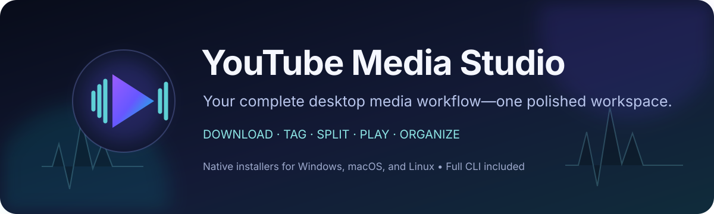
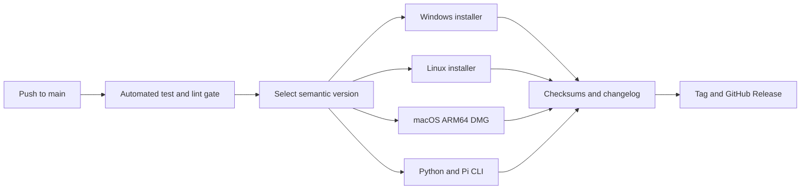

<p align="center">
  
</p>

<p align="center">
  <a href="https://github.com/DhimanGhosh/YouTube_Media_Studio/releases/latest"></a>
  <a href="https://github.com/DhimanGhosh/YouTube_Media_Studio/actions/workflows/cross-platform-build.yml"></a>
  
  
</p>

<p align="center">
  <a href="#download"><b>Download</b></a> ·
  <a href="#using-the-desktop-app"><b>User guide</b></a> ·
  <a href="#see-it-running"><b>See it running</b></a> ·
  <a href="#what-it-does"><b>Features</b></a> ·
  <a href="#how-ai-helps"><b>AI</b></a> ·
  <a href="#command-line"><b>CLI</b></a> ·
  <a href="#develop"><b>Develop</b></a> ·
  <a href="CHANGELOG.md"><b>Changelog</b></a> ·
  <a href="PRIVACY.md"><b>Privacy</b></a>
</p>

**One AI-powered studio for the entire media workflow.** YouTube Media Studio combines a modern
PyQt6 desktop application with a scriptable command line to download permitted media,
write metadata and artwork, split albums and jukeboxes, edit files,
and manage a local playback library.

> **Everything required by the desktop app travels with the installer.** Python,
> FFmpeg, FFprobe, Deno, yt-dlp, and application dependencies are bundled—no developer
> environment and no administrator access are required.

## See it running

<p align="center">
  
</p>
<p align="center"><em>The dashboard brings every downloader, splitter, metadata tool, log, and library action into one responsive workspace.</em></p>

The same installation also provides a complete terminal interface:

```console
$ youtube-media-studio doctor
FFmpeg:  .../runtime-tools/ffmpeg
FFprobe: .../runtime-tools/ffprobe
Deno:    .../runtime-tools/deno
yt-dlp:  installed
Bundled tools: .../runtime-tools
```

The release also includes a standard Python wheel. Install it and call the same
background workflows used by the desktop forms:

```console
python -m pip install youtube_media_studio-v2.9.1-py3-none-any.whl
```

Installing a newer wheel with the same command automatically removes the older
`youtube-media-studio` package version and installs the new version in its place.

**[Open the complete Python wheel and library guide →](docs/PYTHON_LIBRARY.md)**

```python
from youtube_audio_video_downloader import MediaStudio

studio = MediaStudio(defaults={"ai_enabled": False, "workers": 4})
result = studio.audio(
    input_data={
        "Example": {
            "url": "https://www.youtube.com/watch?v=...",
            "album": "Example Album",
            "artists": "Example Artist",
        }
    },
    output_dir="downloads",
)
print(result.as_dict())
```

`MediaStudio.operations` lists every supported GUI workflow. Each name is also a
method on the client (`audio`, `video`, `album`, `jukebox`, `edit_media`,
`edit_album`, `album_metadata_enricher`, and the remaining desktop operations).
Use `run_operation(name, params)` for dynamic dispatch and `studio.cancel()` for
cooperative cancellation from another thread. The public API does not import PyQt6,
so the base wheel is sufficient for library-only use.

## Download

Get the newest tested build from **[GitHub Releases](https://github.com/DhimanGhosh/YouTube_Media_Studio/releases/latest)**.

| Your system | What to download | Interface | Installation |
| --- | --- | --- | --- |
| **Windows 10/11 x64** | `YouTubeMediaStudio-*-windows-amd64-Setup.exe` | Desktop + optional CLI | Run the setup wizard |
| **macOS Apple silicon** | `youtube-media-studio-*-macos-arm64-installer.dmg` | Desktop app | Open DMG, drag app to Applications |
| **Desktop Linux x64** | `youtube-media-studio-*-linux-x86_64-installer.run` | Desktop + optional CLI | Make executable, then launch |
| **Raspberry Pi OS 64-bit** | `youtube-media-tools-*-raspi-cli.tar.gz` | CLI only | Extract and run `install.sh` |

Checksums for every artifact are published as `SHA256SUMS.txt` in the same release.

<details>
<summary><b>Windows installation</b></summary>

1. Download and run the Windows setup executable.
2. Choose the destination folder.
3. Select the optional command-line tools if wanted.
4. Select **Install**, then launch the app from the Start menu.

The per-user installer does not request administrator access. Remove it later from
**Settings → Apps → Installed apps → YouTube Media Studio**. The uninstaller can
optionally retain or remove settings, history, and application data.

When a previous release is installed, Setup automatically detects its registered
folder and offers **Upgrade**, **Repair**, and **Uninstall**. Upgrade and Repair close
the running app if necessary, remove the old application files, and install fresh
binaries in place while preserving settings, history, and application data. Uninstall
can optionally remove that data. Setup matches the complete executable path, so another
program with a similar process name is never closed.

</details>

<details>
<summary><b>macOS installation</b></summary>

1. On an Apple-silicon Mac, download the ARM64 DMG.
2. Open it and drag `YouTubeMediaStudio.app` to **Applications**.
3. Launch `YouTubeMediaStudio.app` from Applications.

Unsigned releases can be installed, but macOS Gatekeeper may block the first launch
because Apple cannot verify the app with its notarization service. After dragging the
app to Applications, run this once on that Mac:

```sh
xattr -dr com.apple.quarantine /Applications/YouTubeMediaStudio.app
open /Applications/YouTubeMediaStudio.app
```

If macOS still refuses to open it, apply a local ad-hoc signature and remove the
quarantine flag again:

```sh
codesign --force --deep --sign - /Applications/YouTubeMediaStudio.app
xattr -dr com.apple.quarantine /Applications/YouTubeMediaStudio.app
open /Applications/YouTubeMediaStudio.app
```

This local workaround must be repeated by each Mac user who installs an unsigned
build. Releases built with the signing secrets documented below are Developer ID
signed and notarized for normal Gatekeeper launch.

</details>

<details>
<summary><b>macOS release signing</b></summary>

To avoid Gatekeeper warnings for public macOS downloads, configure these GitHub
Actions repository secrets before publishing a release:

| Secret | Value |
| --- | --- |
| `MACOS_CERTIFICATE_P12_BASE64` | Base64-encoded Developer ID Application `.p12` certificate |
| `MACOS_CERTIFICATE_PASSWORD` | Password used when exporting the `.p12` |
| `MACOS_KEYCHAIN_PASSWORD` | Temporary CI keychain password |
| `MACOS_CODESIGN_IDENTITY` | Certificate name, such as `Developer ID Application: Your Name (TEAMID)` |
| `APPLE_ID` | Apple Developer account email |
| `APPLE_TEAM_ID` | Apple Developer Team ID |
| `APPLE_APP_SPECIFIC_PASSWORD` | App-specific password for notarization |

When these secrets are present, the macOS release job signs the app with hardened
runtime, notarizes and staples the app, builds the drag-and-drop DMG, then signs,
notarizes, and staples the DMG. Without them, CI still creates an unsigned DMG.

</details>

<details>
<summary><b>Linux installation</b></summary>

```sh
chmod +x youtube-media-studio-*-installer.run
./youtube-media-studio-*-installer.run
```

Choose the optional CLI during setup if wanted. The desktop app appears in the
application menu; the CLI is installed to `~/.local/bin`.

Running a newer installer over an existing desktop installation opens the same
Upgrade, Repair, and Uninstall maintenance choices.

On a minimal distribution, standard Qt/OpenGL/XCB/audio libraries may also be
required. The graphical uninstaller is available from the application menu, or run:

```sh
~/.local/opt/youtube-media-studio/youtube-media-studio-uninstaller --uninstall
```

</details>

<details>
<summary><b>Raspberry Pi CLI installation</b></summary>

Use 64-bit Raspberry Pi OS with Python 3.11 or newer:

```sh
tar -xzf youtube-media-tools-*-raspi-cli.tar.gz
cd youtube-media-tools-*-raspi-cli
./install.sh
echo 'export PATH="$HOME/.local/share/youtube-media-tools/bin:$PATH"' >> ~/.profile
. ~/.profile
youtube-media-studio doctor
```

The Pi package intentionally excludes PyQt6. FFmpeg, FFprobe, and Deno must be
available on the Pi. Remove the package with `youtube-media-studio-uninstall`.

</details>

## Using the desktop app

The desktop interface is organized as task-focused pages: search, download, split,
edit, consolidate, inspect logs, configure defaults, and play the finished library.

1. Open **Global Settings** once to confirm download and application-data defaults.
2. Use **Search Song** to find a source, or open a downloader/splitter directly when
   you already have its URL.
3. Review metadata and output locations before starting an operation.
4. Follow progress on **Dashboard** and inspect skipped items in **Live Logs**.

**[Open the complete desktop user guide →](docs/USER_GUIDE.md)**

| I want to… | Instructions |
| --- | --- |
| Understand every sidebar screen | [Screen reference](docs/USER_GUIDE.md#screen-reference) |
| Find and download a song | [Song workflow](docs/USER_GUIDE.md#find-and-download-a-song) |
| Split an album or jukebox | [Splitter workflow](docs/USER_GUIDE.md#split-an-album-or-jukebox) |
| Repair or trim a local file | [Edit File guide](docs/USER_GUIDE.md#edit-a-local-media-file) |
| Retag a complete album folder | [Edit Album guide](docs/USER_GUIDE.md#edit-an-album-folder) |
| Enrich and move an existing music folder | [Album Consolidator guide](docs/USER_GUIDE.md#enrich-and-organize-an-existing-music-folder) |
| Browse and play my local collection | [Media Library guide](docs/USER_GUIDE.md#use-the-local-media-library) |
| Understand a skip, review, or failure | [Live Log glossary](docs/USER_GUIDE.md#read-live-logs) |
| Use the application safely | [File-safety rules](docs/USER_GUIDE.md#file-safety-rules) |

> [!IMPORTANT]
> Keep a backup and test file-changing workflows on a small folder first. Download only
> media you are authorized to use.

## What it does

| Workspace | Capability |
| --- | --- |
| **Audio Downloader** | Download permitted audio with an independent start/end range for each song, write tags, embed artwork, and normalize filenames |
| **Video Downloader** | Inspect formats and download video/audio with an independent timestamp range for each batch entry |
| **Album Splitter** | Turn a full-album source and timestamps into individual tagged tracks |
| **Jukebox Splitter** | Split compilation videos and organize the resulting songs |
| **Search Song** | Find tracks, albums, release years, performers, and cover artwork |
| **Metadata tools** | Inspect, repair, reorder, retag, trim, rename, and consolidate local media |
| **Edit Album** | Change album name, year, track artist(s), and optional album artwork across every supported file in a folder |
| **Media Library** | Browse, filter, create persistent path-based playlists, play, queue, and semantically curate local media |
| **Utilities** | Normalize artist names and convert timestamps to splitter-ready JSON |
| **Live Logs** | Follow background operations and diagnose failures without leaving the app |
| **Automation** | Run the same core workflows through stable CLI commands and JSON job files |

The application stores settings and working data in a writable per-user directory,
and the GUI can persist a custom location.

## How AI helps

AI is an optional verification and library-curation assistant for workflows that expose
**Use AI for this task**. Agno coordinates specialized planning, evidence, semantic
verification, and ranking agents for **Smart Library Curator**, while the existing
safety agents review metadata evidence and conflicting identities. Downloads, editing,
splitting, playback, and deterministic catalog matching continue to work with AI off.

| Mode | Setup | What happens |
| --- | --- | --- |
| **Local AI with Ollama** | Install and run Ollama separately, download a compatible model, then select **Ollama (local)** and the model under **Global Settings → AI providers and online evidence**. No API key is required. | Prompts and model responses stay on the user's computer. Internet evidence is still contacted when the selected workflow requires it. |
| **Hosted AI with an API key** | Select NVIDIA NIM, OpenAI, Anthropic, Google Gemini, Groq, Hugging Face Inference, OpenRouter, or OpenCode Zen; then save that provider's key and model. | The selected provider runs through Agno. Its password-masked key/model draft is retained independently, and Ollama is the local fallback. |
| **Compatible endpoint** | Select **Custom OpenAI-compatible**, enter its `/v1` base URL and model, and add a key only if the endpoint requires one. | Self-hosted and other compatible services can participate without provider-specific application code. |
| **No AI** | Leave **Use AI for this task** off. | Wikipedia, catalog, web evidence, SerpApi (when separately configured), and deterministic rules perform the work without model calls. |

AI does not invent missing tags or override conflicting evidence. If the available sources
cannot establish a safe identity, the file remains unchanged and Live Logs reports a
review outcome. A SerpApi key is separate from an AI-provider key: it enables authenticated
Google Search and Google Images evidence, not language-model inference.

Smart Library Curator exposes a 1–20 result control and also understands explicit counts
such as `return 10 results`. **Start mix** queues the exact mood/style matches first, then
uses a second evidence-grounded pass to continue with other local tracks in the requested
language. Language, mood, style, activity, energy, and tempo labels must agree with catalog
or web evidence; a model assertion alone cannot admit a track or invent extra result traits.
When a related term such as `melancholic` supports `sad`, the verifier must cite that
exact phrase from the bounded evidence for the same recording.
Saved playlist names and their indexed track metadata also act as positive taste examples.
The configured AI model semantically decides which playlist themes relate to each request;
there is no fixed synonym mapping, so a model can connect differently worded concepts such
as a playlist's tempo/theme and the requested listening activity. Relevant playlist members
may be included as personal taste matches, and a concise version of the same context is used
when **Search YouTube too** is selected. This is request-time contextual personalization,
not permanent model-weight training; media paths and files are not sent.

Provider keys are stored separately: switching providers does not copy one provider's
credential into another, and clearing a key remains cleared after **Save and apply
defaults** and restart. See the [desktop user guide](docs/USER_GUIDE.md#how-ai-helps)
for configuration, fallback order, privacy notes, and log meanings.

Album Enricher uses Wikipedia and Apple's public catalog by default. Users may add
their own optional [SerpApi](https://serpapi.com/) key under **Global Settings** to use
Google Search as a fallback when those sources cannot identify an album or movie.

## Command line

```text
youtube-media-studio [--data-dir FOLDER] <command> [options]
```

| Command | Purpose |
| --- | --- |
| `audio` | Download and tag audio from a JSON job file |
| `video` | Inspect or download video/audio |
| `album` | Split a full-album source |
| `jukebox` | Split a compilation source |
| `duplicates` | Find duplicate links in job files |
| `artists` | Normalize artist names |
| `timestamps` | Convert timestamp text to track JSON |
| `doctor` | Verify FFmpeg, FFprobe, Deno, and yt-dlp |

```sh
youtube-media-studio audio config/songs.json
youtube-media-studio video config/videos.json
youtube-media-studio album config/albums.json
youtube-media-studio doctor
```

Run `youtube-media-studio <command> --help` for command-specific options.

## How the release pipeline works

Every successful push to `main` produces a complete, versioned release:



Versions follow conventional commit intent:

- `feat: ...` creates a **minor** release.
- `type!: ...` or `BREAKING CHANGE:` creates a **major** release.
- Other successful changes create a **patch** release.
- Any failed test or platform build prevents the tag and release.

The chosen version is included in every installer filename, Python package, checksum
manifest, changelog entry, Git tag, and release title.

## Develop

### Prerequisites

- Windows, macOS, or desktop Linux
- Python 3.11 or newer
- [uv](https://docs.astral.sh/uv/)
- Git

```sh
git clone https://github.com/DhimanGhosh/YouTube_Media_Studio.git
cd YouTube_Media_Studio
uv sync --extra gui --group dev
uv run python run_gui.py
```

Run the CLI from the checkout:

```sh
uv run youtube-media-studio --help
uv run youtube-media-studio doctor
```

Tracked job templates live in `config/*.sample.json`. Copy only the templates you
need to their non-sample names; those local files are ignored by Git.

<details>
<summary><b>Quality checks and native builds</b></summary>

Run the same gate used by GitHub Actions:

```sh
uv run python tools/release.py check
```

Build for the current desktop operating system:

```sh
uv run python tools/release.py plan
uv run python tools/release.py build --target current
```

Or build a non-desktop artifact:

```sh
uv run python tools/release.py build --target wheel
uv run python tools/release.py build --target raspi
```

Desktop builds are native—Windows installers build on Windows, DMGs on macOS, and
Linux installers on Linux. Outputs and SHA-256 manifests are written to `dist/`.

</details>

## Project map

```text
assets/                              App icons and desktop integration
config/                              Tracked JSON job templates
docs/media/                          README artwork and product screenshots
src/youtube_audio_video_downloader/
  cli/                               Command-line entry points
  config/                            Settings and runtime discovery
  core/                              Shared filesystem and cancellation tools
  domain/                            Data models
  gui/                               PyQt6 desktop application
  loaders/                           Job-file loading
  metadata/                          Media tagging
  services/                          Download, editing, search, and library logic
  utils/                             Parsing and normalization helpers
tests/                               Automated test suite
tools/desktop_installer.py           Native graphical installer/uninstaller
tools/release.py                     Validation, packaging, and release entry point
```

## Architecture and design

- [Architecture documentation hub](docs/ARCHITECTURE.md)
- [High-level design](docs/HIGH_LEVEL_DESIGN.md)
- [Low-level design](docs/LOW_LEVEL_DESIGN.md)
- [Workflow sequence diagrams and flowcharts](docs/WORKFLOW_DESIGNS.md)
- [Python wheel installation, upgrades, and complete library API](docs/PYTHON_LIBRARY.md)

## Application data

| Platform | Default location |
| --- | --- |
| Windows | `%APPDATA%\DhimanTools\YouTube Media Studio` |
| macOS | `~/Library/Application Support/DhimanTools/YouTube Media Studio` |
| Linux | `$XDG_DATA_HOME/DhimanTools/YouTube Media Studio` or `~/.local/share/...` |

Use `--data-dir FOLDER` for a one-run CLI override.

## Troubleshooting

Start with:

```sh
youtube-media-studio doctor
```

- Reopen the terminal after enabling the Windows CLI so the updated user `PATH` loads.
- Add `~/.local/bin` to `PATH` when a macOS/Linux shell cannot find the CLI.
- Begin with the tracked sample files and keep job JSON encoded as UTF-8.
- Update yt-dlp frequently when running from source because source sites change.
- Include the generated crash report, operating system, and exact command when reporting an issue.

## Responsible use and third-party software

Download only material you are authorized to access. Follow source-service terms and
applicable law. Packaged releases contain third-party runtimes; their sources,
copyrights, and licenses are documented in [THIRD_PARTY_NOTICES.md](THIRD_PARTY_NOTICES.md).

---

<p align="center">
  Built as a native-feeling desktop application for Windows, macOS, and Linux—with the same workflows available from the command line.
</p>
