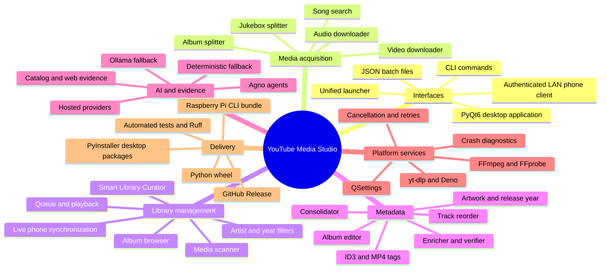

# Architecture documentation

This documentation set describes the implemented architecture of YouTube Media Studio.
It is intended for maintainers, reviewers, and contributors who need to understand how
the desktop UI, CLI, background workers, media services, AI agents, persistence, and
release automation fit together.

## Documents

| Document | Scope |
| --- | --- |
| [High-level design](HIGH_LEVEL_DESIGN.md) | System context, containers, deployment, data ownership, external integrations, and quality attributes |
| [Low-level design](LOW_LEVEL_DESIGN.md) | Python package boundaries, principal classes, operation dispatch, domain models, concurrency, persistence, and extension points |
| [Workflow designs](WORKFLOW_DESIGNS.md) | Sequence diagrams and flowcharts for downloads, splitting, enrichment, curation, playback, editing, cancellation, and releases |

## Project mind map

## Architectural principles

1. **One service layer, multiple interfaces.** Desktop and CLI entry points reuse the
   same downloader, splitter, metadata, and library services.
2. **The GUI thread stays responsive.** Long operations run in `QThread` workers or
   bounded thread pools and report progress through Qt signals.
3. **Evidence gates metadata mutation.** AI can plan or adjudicate, but catalog/web
   corroboration and deterministic validation decide whether uncertain changes are safe.
4. **Local-library curation never substitutes external files.** Curator results refer
   only to indexed `LibraryItem` paths; YouTube search is an explicit separate action.
5. **Per-item intent remains per item.** Batch entries own metadata, resolution, and
   timestamp ranges so one row cannot silently change another row's download.
6. **User data is separate from application binaries.** Settings, trackers, diagnostics,
   and workspace drafts live in a writable application-data directory that survives
   upgrades.
7. **File changes are recoverable where practical.** Services use retry-aware access,
   conflict-safe output names, transaction-like replacements, and explicit skip/review
   results instead of silent overwrites.

## Reading order

Start with the [high-level design](HIGH_LEVEL_DESIGN.md), then use the
[low-level design](LOW_LEVEL_DESIGN.md) for code ownership. Refer to
[workflow designs](WORKFLOW_DESIGNS.md) when changing a particular execution path.

## Stable 2.x library and download synchronization

Filesystem notifications debounce into background scans; completed batch items also
request scans. The 15-second backup timer skips busy scans. Manual Refresh interrupts
the current scan cooperatively and schedules one replacement. Scanner completion is
emitted even on error; interrupted/error results never replace the existing index.
File disappearance during metadata reading is tolerated. Changed modification times
invalidate artwork, and indexed queue entries receive fresh metadata. Queue deletion
preserves the playing file identity and removes only successfully deleted paths.
Metadata replacement retains file permissions but advances modification time.

`services/downloads/parallel_http.py` customizes each yt-dlp instance's progressive
HTTP downloader. A one-byte probe verifies Content-Range, then bounded workers write
validated disjoint ranges to private staging. Ranges retry transient failures;
cancellation removes staging; only a complete joined file is published. Unsupported
ranges fall back to native HTTP. DASH/HLS, live streams, and FFmpeg timestamp ranges
keep their native downloaders. Source transfer telemetry retains its actual mode at
completion and displays individual progress only for measured byte ranges.

Album batch concurrency uses one pool for whole-album jobs and individual-track jobs.
Each workspace run has its own pool, bounded by the saved worker count. Operation
summaries carry per-item failure reasons into expanded editor entries for retry.
See [the user guide](USER_GUIDE.md) for the current menu and Settings navigation.
