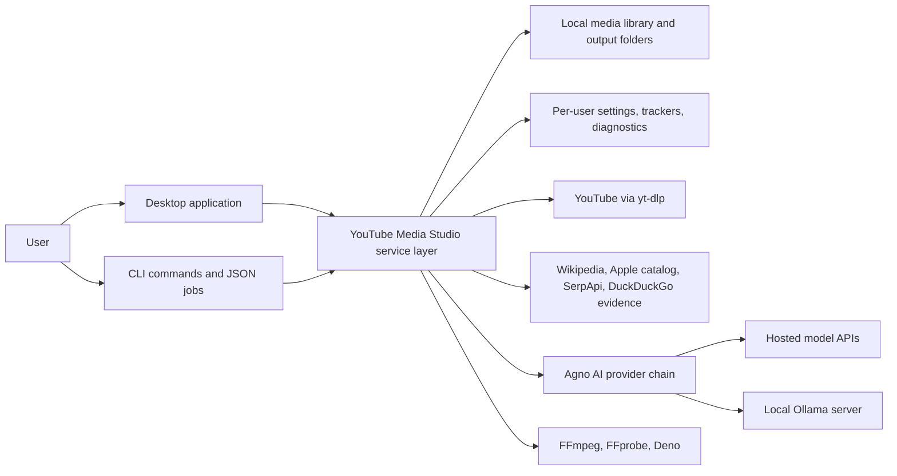
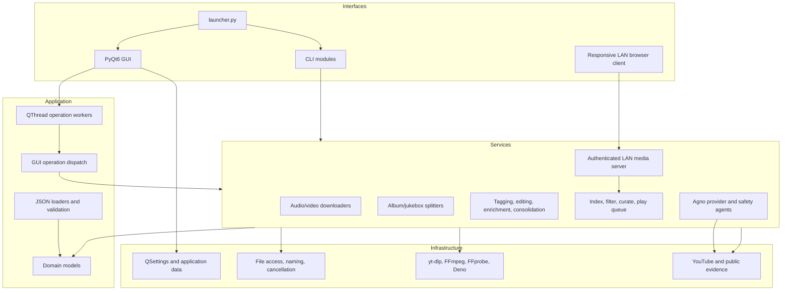
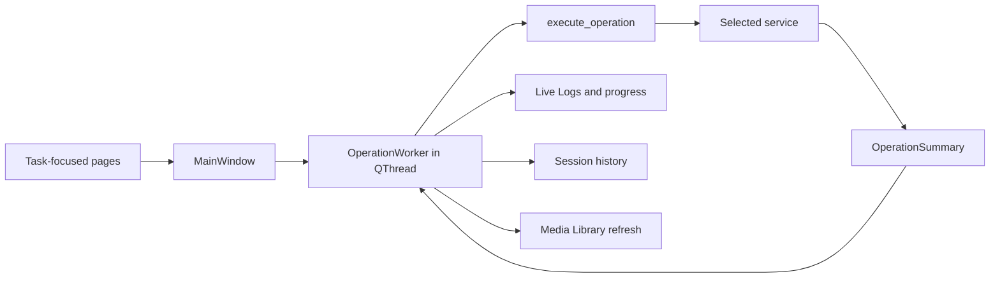
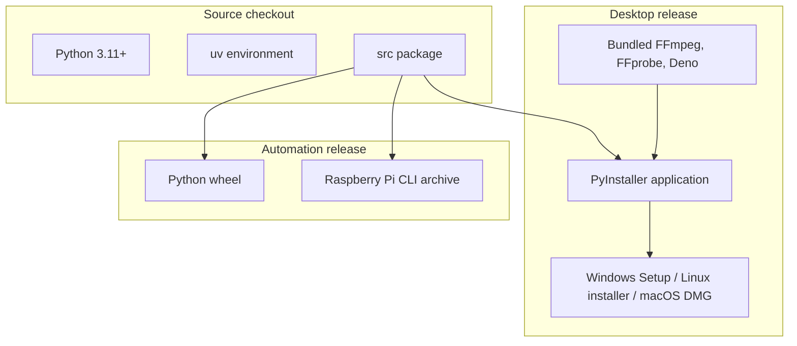
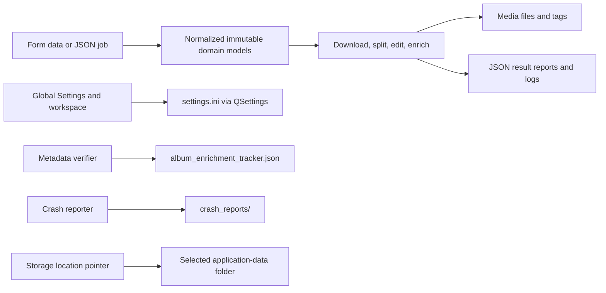
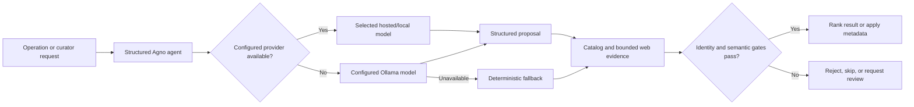

# High-level design

## 1. Purpose and scope

YouTube Media Studio is a cross-platform Python application for authorized media
acquisition, splitting, tagging, editing, organization, search, and local playback. It
ships as a PyQt6 desktop application and as command-line tools. Media work is performed
by a shared service layer using yt-dlp, FFmpeg/FFprobe, Mutagen, public catalog sources,
and optional Agno-coordinated AI providers.

## 2. System context

### Actors and external systems

| Actor/system | Responsibility |
| --- | --- |
| User | Configures jobs, reviews results, starts/cancels work, and owns source/output rights |
| YouTube/yt-dlp | Source metadata, stream discovery, and permitted media transfer |
| FFmpeg/FFprobe | Transcoding, splitting, trimming, probing, and container work |
| Catalog/evidence services | Album, song, year, artwork, language, mood, style, and identity evidence |
| Hosted AI providers | Optional structured planning and verification through Agno |
| Ollama | Optional local primary model or fallback model |
| GitHub Actions | Tests, packages, versions, tags, and publishes releases |

## 3. Logical containers

## 4. Desktop composition

The desktop shell owns navigation, global settings, session history, live logs, and
operation lifecycle. Task pages collect inputs and turn them into plain parameter
dictionaries. `OperationWorker` executes the selected operation outside the GUI thread,
captures service output, and emits structured progress, completion, failure, cancellation,
and file-in-use signals.

The Media Library is a persistent page with its own background scanner, search worker,
recommendation worker, path-based playlist store, queue, and `QMediaPlayer`. Playback
continues while the user visits other pages. While the desktop runs, its embedded
`ThreadingHTTPServer` publishes a path-hiding snapshot to PIN-authenticated browsers on
the private LAN. Phone actions cross a Qt signal boundary before mutating the desktop
queue, playlists, or curator, and clients poll snapshot revisions for bidirectional sync.

## 5. Deployment view

Desktop builds run natively on Windows, Ubuntu, and Apple-silicon macOS. The Raspberry Pi
archive intentionally excludes PyQt6 and expects compatible media runtimes on the device.

## 6. Data architecture

Key ownership rules:

- Batch JSON or editor rows own per-entry source URLs, metadata, resolution, download
  enablement, and start/end timestamps.
- `settings.ini` owns UI defaults, provider-specific credentials, workspace drafts,
  library folders, volume, shuffle, repeat mode, and window state.
- Media tags remain the source of truth for library title, album, artist, year, artwork,
  track number, and duration display.
- The enrichment tracker records completion by verifier policy so an older or weaker
  decision cannot incorrectly suppress a newer validation pass.

## 7. AI and evidence architecture

Provider definitions are centralized. Ollama, NVIDIA NIM, OpenAI, Anthropic, Google
Gemini, Groq, Hugging Face Inference, OpenRouter, OpenCode Zen, and custom
OpenAI-compatible endpoints resolve into Agno model objects. Hosted failure triggers one
direct local retry. Constrained curator filters fail closed when neither model nor
independent evidence can safely establish the requested property.

## 8. Security, privacy, and safety boundaries

- API keys are password-masked, stored per provider in local settings, omitted from logs,
  and removable by saving an explicitly blank value.
- The curator sends bounded metadata/evidence, not media file contents, to model APIs.
- Local Ollama inference stays local, while evidence lookups may still use the internet.
- File mutation services validate paths and formats, use collision-safe names, preserve
  tags where appropriate, and surface file locks rather than forcibly overwriting files.
- Cancellation tokens coordinate worker pools and subprocess termination.
- Download authorization remains the user's responsibility.

## 9. Quality attributes

| Attribute | Design response |
| --- | --- |
| Responsiveness | QThread workers, thread pools, debounced library search, asynchronous artwork/evidence |
| Reliability | Bounded retries, completion reports, cancellation, skip-existing behavior, transactional replacement |
| Correctness | Immutable normalized models, input validation, evidence gates, conservative fallbacks |
| Portability | Python service layer, runtime discovery, native platform packaging |
| Maintainability | Layered packages, central operation dispatch, provider registry, focused tests |
| Observability | Live logs, progress phases, result summaries, crash diagnostics, CI checks |
| Scalability | Bounded workers/candidates/evidence calls and lazy library rendering |

## 10. Major constraints

- Source-site changes can require yt-dlp updates.
- Desktop packaging is native per operating system.
- Public evidence can be incomplete; safety rules prefer no result over a fabricated one.
- Ollama CPU/GPU placement is controlled by the Ollama runtime and available VRAM; the
  app limits context allocation but does not override the runtime's device scheduler.
- GUI state is local to a user profile and is not a multi-user database.
