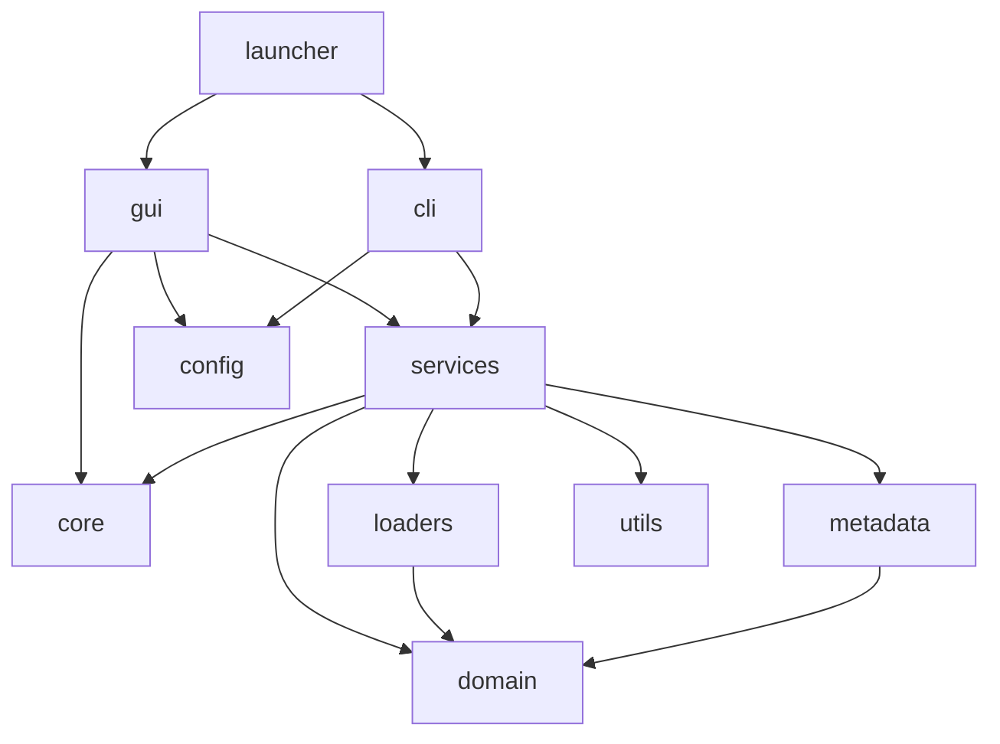
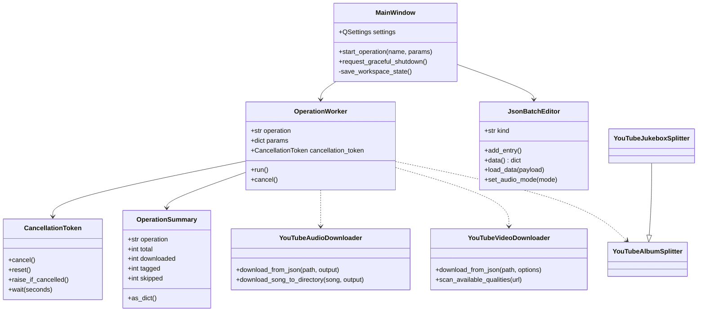
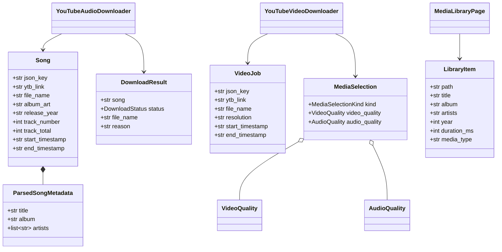
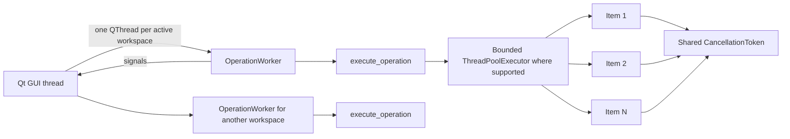
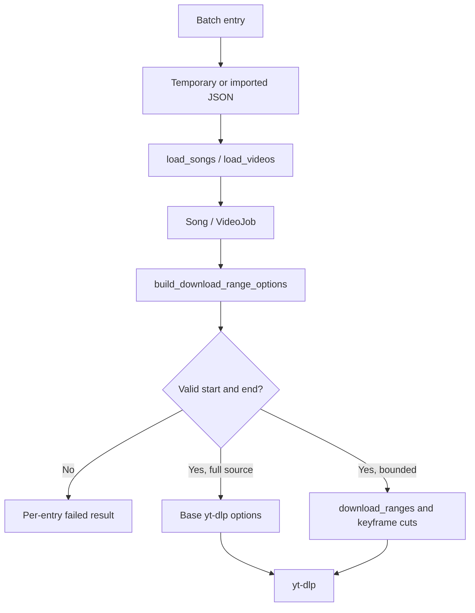
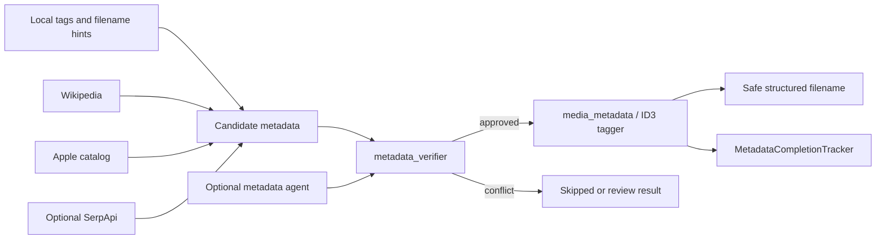
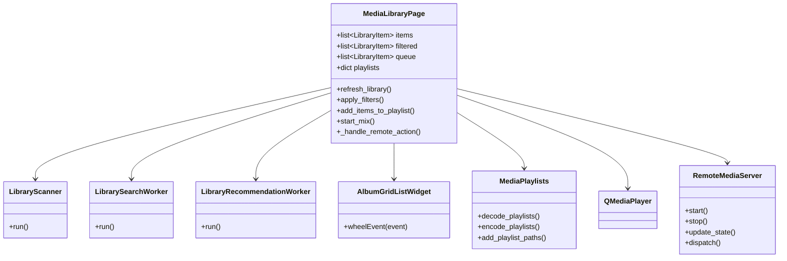
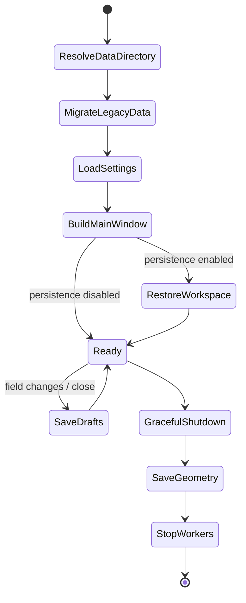

# Low-level design

## 1. Package dependency model

Dependencies should point downward. Services must not depend on GUI widgets. CLI modules
parse arguments and delegate; GUI pages build parameter dictionaries and delegate.

## 2. Module responsibilities

| Package/module | Responsibility |
| --- | --- |
| `launcher.py` | Select GUI, CLI command, or runtime doctor; configure bundled tools |
| `gui/app.py` | Create `QApplication`, storage, crash reporting, palette, and `MainWindow` |
| `gui/main_window.py` | Navigation, forms, settings, operation lifecycle, dashboard, live logs |
| `gui/widgets.py` | Reusable controls, batch editors, collapsible sections, async form helpers |
| `gui/workers.py` | Background execution, retries, log capture, cancellation, progress signals |
| `gui/operations.py` | Map operation names to service calls and normalize summaries |
| `gui/media_player.py` | Library scan/search, album browser, queue, playback, curator presentation |
| `domain/models.py` | Immutable normalized download and selection records |
| `loaders/json_loader.py` | Validate batch JSON and construct domain models |
| `services/*_downloader.py` | Download planning, parallel execution, yt-dlp options, result reports |
| `services/*_splitter.py` | Source acquisition, segment planning, FFmpeg splitting, tagging |
| `services/media_*.py` | Scan, read/write tags, edit, trim, and redownload local media |
| `services/album_*.py` | Album naming, editing, enrichment, folder normalization, consolidation |
| `services/agno_provider.py` | Agno model construction, structured output, primary/fallback execution |
| `services/*agent*.py` | Operation preflight, metadata adjudication, and semantic decisions |
| `config/app_storage.py` | Resolve/migrate persistent application-data directories |
| `config/runtime_tools.py` | Find bundled/system tools and hide Windows subprocess consoles |
| `core/*` | Cancellation, exceptions, file access retries, safe filesystem names |
| `tools/release.py` | Test/lint gate and artifact build orchestration |
| `tools/prepare_release.py` | Semantic version choice and changelog promotion |

## 3. Core class model

## 4. Domain model

`Song` and `VideoJob` are frozen dataclasses. Each owns its own timestamp range. Empty
start resolves to `00:00`; an empty end means source end. `build_download_range_options`
validates and converts that pair immediately before building the entry's yt-dlp options.

## 5. GUI operation registry

`execute_operation` is the application-service boundary for desktop tasks.

| Operation key | Primary implementation |
| --- | --- |
| `audio` | `YouTubeAudioDownloader` or existing-file tag mode |
| `video` | `YouTubeVideoDownloader` |
| `album` | `YouTubeAlbumSplitter` |
| `jukebox` | `YouTubeJukeboxSplitter` |
| `track_reorder` | `reorder_track_numbers` |
| `audio_trimmer` | `trim_audio` |
| `redownload` | `redownload_media` |
| `edit_media` | `edit_media_file` |
| `edit_album` | `edit_album_folder` |
| `album_consolidator` | enrichment, `consolidate_albums`, folder normalization |
| `album_metadata_enricher` | `enrich_folder_metadata` |
| `duplicate_links` | CLI-compatible duplicate scanner; no desktop Utilities panel |
| `format_artists` | artist normalization utility |
| `parse_tracks` | timestamp parser utility |
| `search_song` | intent understanding and YouTube search |
| `enrich_song` | metadata enrichment for a selected search result |

Every operation emits an AI-usage decision, optionally performs an advisory preflight,
checks cancellation, runs its handler, and returns `OperationSummary`.

## 6. Worker and concurrency model

- `OperationWorker` redirects stdout/stderr into line-buffered Qt log signals.
- Distinct operations can own independent `QThread`/`OperationWorker` pairs at the same
  time. A workspace action is disabled only while that same operation is running; a
  duplicate start is rejected without blocking the other workspaces.
- Operation-level retries are limited to workflows that are safe to repeat.
- Download/split/enrichment services may run item-level thread pools bounded by global
  worker settings and input size.
- A shared cancellation token interrupts waits, stops new work, and allows active units
  to exit cooperatively. The global **Stop** action sends cancellation to every active
  operation worker.
- File-in-use handling pauses the worker until the user retries or cancels.

## 7. Download option construction

Audio and video use the same parser. When Video Downloader emits MP3, it constructs a
`Song` carrying the originating `VideoJob` timestamps so both selected outputs cover the
same interval.

## 8. Metadata subsystem

The verifier groups compatible independent sources, checks local conflicts, and only
returns writable values when the proposal belongs to a supported evidence group.

## 9. Media Library internals

Library scanning reads supported files recursively and returns fresh immutable
`LibraryItem` objects. Search is debounced and filters one authoritative `items` list.
Artist selection filters both track and album views. The album grid uses per-pixel
scrolling but advances by one configured grid row for each mouse-wheel notch.
Playlists persist ordered file paths under `library/playlists`; resolving their display
metadata against the latest scan keeps the link authoritative while still showing a
clear missing-file state. Duplicate comparison is case-insensitive, and the caller must
choose whether duplicates are skipped or deliberately retained.

Every track-table rebuild calls `resizeColumnsToContents()` after its rows are populated;
headers remain interactive, but album, artist, search, and year changes recalculate widths
from the largest visible value in each current column.

`RemoteMediaServer` owns only serialized state, opaque media IDs, an allowlist of indexed
paths, a random launch PIN/token, and a callback. Its request threads never touch Qt
widgets. `MediaLibraryPage.remote_action_requested` carries accepted actions to the GUI
thread, where existing queue, playlist persistence, and curator methods remain the sole
mutation paths. State publication is revisioned and protected by a re-entrant lock; the
browser polls only until the desktop stops the server during shutdown.

## 10. Persistence keys and lifecycle

Settings are grouped under `defaults/`, `ai/tools/`, `workspace/`, `library/`, `window/`,
`privacy/`, and `analytics/`. Provider credentials use a provider-specific subtree.
Changing the application-data folder copies existing data without overwriting newer
destination files and applies the new location on restart.

## 11. Extension points

- Add a GUI operation by implementing a service, an `_run_*` adapter returning
  `OperationSummary`, and one registry entry.
- Add an AI provider by extending `ProviderDefinition` and model construction while
  preserving provider-specific saved drafts and Ollama fallback.
- Add a media format by extending library suffix discovery and `media_metadata` read/write
  adapters, then covering artwork and numbering semantics.
- Add a release target in `tools/release.py` and the GitHub Actions build matrix; artifact
  naming and checksum generation must remain versioned and deterministic.
