# YouTube Media Studio user guide

This is the complete desktop-application guide for a first-time user. It covers every
sidebar workspace, the controls inside each workspace, automatic internet and AI
assistance, the local Media Library, phone access, playback, and the checks to perform
before changing files. No Python or command-line knowledge is required.

For installation packages and platform requirements, see the
[main README](../README.md#download).

## Contents

- [Read the screenshots](#read-the-screenshots)
- [First-time setup](#first-time-setup)
- [How the interface works](#how-the-interface-works)
- [Screen reference](#screen-reference)
- [Configure Global Settings](#configure-global-settings)
- [How AI and internet evidence work](#how-ai-and-internet-evidence-work)
- [Use Dashboard](#use-dashboard)
- [Find and download a song](#find-and-download-a-song)
- [Use Audio Downloader](#use-audio-downloader)
- [Use Video Downloader](#use-video-downloader)
- [Split an album or jukebox](#split-an-album-or-jukebox)
- [Reorder an album](#reorder-an-album)
- [Edit a local media file](#edit-a-local-media-file)
- [Edit an album folder](#edit-an-album-folder)
- [Enrich and organize an existing music folder](#enrich-and-organize-an-existing-music-folder)
- [Use Utilities](#use-utilities)
- [Use the local media library](#use-the-local-media-library)
- [Read Live Logs](#read-live-logs)
- [File-safety rules](#file-safety-rules)
- [Troubleshooting](#troubleshooting)

> [!IMPORTANT]
> Download only media you are authorized to use. Keep a backup before running metadata,
> editing, consolidation, or duplicate-removal operations over a
> valuable library. Test each workflow on a small copy first.

## Read the screenshots

Every screenshot in this guide was captured from the real desktop application at a
standard 1440 × 900 window size with an isolated empty profile. No personal library
paths, API keys, or user settings are present.

The cyan borders divide a screen into functional areas. Cyan numbers sit outside those
borders so the application's own labels remain visible. The numbered table immediately
after an image explains the matching area. A screenshot shows where a control is; the
text remains the authoritative description of what it does.

## First-time setup

1. Install and start **YouTube Media Studio** from the Windows Start menu, macOS
   Applications, or the Linux application menu.
2. Open **Global Settings**. Select the application data directory, output quality,
   worker count, network retry behavior, and playback seek interval.
3. Decide whether AI should be enabled by default. Ordinary deterministic downloading,
   editing, timestamp parsing, and playback do not require AI.
4. If AI is needed, choose a provider and model. Hosted providers require the user's own
   key; local Ollama does not. Optionally add a SerpApi key for additional Google Search
   and Google Images evidence.
5. Select **Save and apply defaults**.
6. Open **Search Song** when only a plain-language description is known. Open a
   downloader or splitter directly when the source URL is already known.
7. Watch **Dashboard** for overall progress and **Live Logs** for the result of each
   individual item.

The installer bundles the desktop runtime and required media tools. Normal desktop use
does not require a separate Python, FFmpeg, FFprobe, Deno, or yt-dlp installation.
Upgrade and Repair replace program files while retaining settings, history, and
application data. Uninstall separately asks whether that data should also be removed.

On Windows, the Start-menu shortcut is always installed and **Create a desktop
shortcut** is optional. Upgrade and Repair preserve that choice unless it is changed.

### macOS unsigned builds

If macOS blocks an unsigned public DMG on first launch, drag the app to Applications and
run:

```sh
xattr -dr com.apple.quarantine /Applications/YouTubeMediaStudio.app
open /Applications/YouTubeMediaStudio.app
```

If needed, apply a local ad-hoc signature and remove quarantine again:

```sh
codesign --force --deep --sign - /Applications/YouTubeMediaStudio.app
xattr -dr com.apple.quarantine /Applications/YouTubeMediaStudio.app
open /Applications/YouTubeMediaStudio.app
```

## How the interface works

The sidebar selects one of 14 workspaces. A selected workspace remains available while
other jobs run in the background. The application disables only the run button for a
workspace that already has a job, preventing that same task from being started twice.

- **Browse** selects a local file or folder without typing its path.
- **Use AI for this task** is saved separately for each supported workspace.
- **Off = internet search + deterministic verification only** means internet/catalog
  helpers can still be used; only language-model calls are disabled.
- **Open output** opens the latest completed output folder.
- The bottom **Stop** button requests cancellation of every active workspace job. Wait
  for the cancellation result in Live Logs before changing or deleting involved files.
- **Version x.y.z** under the sidebar is the installed application version. Include it
  in a bug report.
- Form state, output folders, statuses, and history are restored after restart when
  workspace persistence is enabled in Global Settings.

## Screen reference

| Sidebar page | Primary purpose | Detailed section |
| --- | --- | --- |
| **Dashboard** | Monitor session activity and open common workspaces. | [Use Dashboard](#use-dashboard) |
| **Search Song** | Turn a plain-language request into previewable YouTube matches. | [Find and download a song](#find-and-download-a-song) |
| **Audio Downloader** | Download tagged MP3s or retag existing MP3 files. | [Use Audio Downloader](#use-audio-downloader) |
| **Video Downloader** | Scan qualities and download full or timestamp-bounded video/audio. | [Use Video Downloader](#use-video-downloader) |
| **Album Splitter** | Auto-fill or manually define one album and split it into tagged tracks. | [Album Splitter](#album-splitter) |
| **Jukebox Splitter** | Split a mixed compilation with per-track metadata. | [Jukebox Splitter](#jukebox-splitter) |
| **Track Reorder** | Drag album tracks into order and rewrite only track-number tags. | [Reorder an album](#reorder-an-album) |
| **Edit File** | Retag, trim, redownload, or save non-destructive video playback framing. | [Edit a local media file](#edit-a-local-media-file) |
| **Edit Album** | Apply shared album metadata/artwork behavior to a folder. | [Edit an album folder](#edit-an-album-folder) |
| **Album Consolidator** | Enrich metadata, then route verified tracks to album folders. | [Enrich and organize](#enrich-and-organize-an-existing-music-folder) |
| **Utilities** | Format artist credits and parse timestamp text into JSON. | [Use Utilities](#use-utilities) |
| **Live Logs** | Inspect, copy, clear, or save detailed operation output. | [Read Live Logs](#read-live-logs) |
| **Global Settings** | Configure shared processing, playback, AI, privacy, and storage defaults. | [Configure Global Settings](#configure-global-settings) |
| **Media Library** | Scan, filter, play, curate, queue, playlist, and serve local media. | [Use the local media library](#use-the-local-media-library) |

## Configure Global Settings

Global Settings controls values shared by the other workspaces. Expand only the group
being changed, then select **Save and apply defaults**. **Reset app** clears tool forms,
saved provider credentials/models, saved state, and restored defaults; it does not act as
a media-library deletion command.

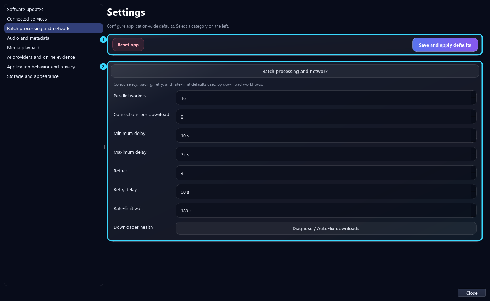

| Callout | Area | Use |
| --- | --- | --- |
| 1 | Settings actions | Reset all application settings or save the edited defaults. |
| 2 | Batch processing and network | Set parallel item workers, per-download connections, randomized delays, retries, retry delay, and the longer rate-limit wait. |
| 3 | Audio and metadata defaults | Expand for MP3 bitrate, sample rate, and Wikipedia track-order behavior. |
| 4 | Media Playback | Expand for audio/video seek controls and video display memory. |
| 5 | AI providers and online evidence | Expand for provider, model, credentials, Ollama fallback, and SerpApi. |

### Batch processing and network

- **Parallel workers** controls how many independent items can run together, up to the
  safe machine-specific maximum shown by the control.
- **Connections per download** controls how many fragments one media item may transfer
  concurrently (1–32, default 8). DASH/HLS sources use genuine parallel fragment
  connections; a progressive source that cannot be segmented accurately uses one
  stream. This is separate from Parallel workers, so their product is the potential
  upper bound on simultaneous network connections.
- **Minimum delay / Maximum delay** define randomized pacing between download requests.
- **Retries** is the bounded number of attempts for retryable work.
- **Retry delay** is the normal wait between failed attempts.
- **Rate-limit wait** is the longer pause used when a service asks the app to slow down.

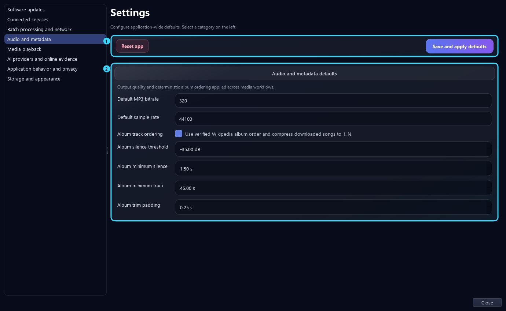

| Callout | Area | Use |
| --- | --- | --- |
| 1 | Settings actions | Save the values after editing. |
| 2 | Batch processing | Collapsed here; expand to change network/concurrency defaults. |
| 3 | Audio and metadata defaults | Select MP3 bitrate, sample rate, and verified Wikipedia ordering. |
| 4 | Media Playback | Set the `<<`/`>>` and keyboard seek interval and choose whether crop/aspect carries to the next video. |
| 5 | AI and online evidence | Collapsed provider group. |
| 6 | Application behavior and privacy | Collapsed state, diagnostics, and suggestion group. |

### Audio, metadata, and playback

- **Default MP3 bitrate** offers 320, 256, 192, or 128 kbps.
- **Default sample rate** offers 44.1 or 48 kHz.
- **Album track ordering** uses verified Wikipedia ordering and compresses a downloaded
  subset to `1..N` when enabled.
- **Seek interval** is used by the `<<` and `>>` player buttons and the Left/Right keys.
  Shift+Left/Right seeks twice this number.
- **Crop/aspect memory** off means each newly loaded video starts at Default. On carries
  the last display choices to the next video and the next application session.

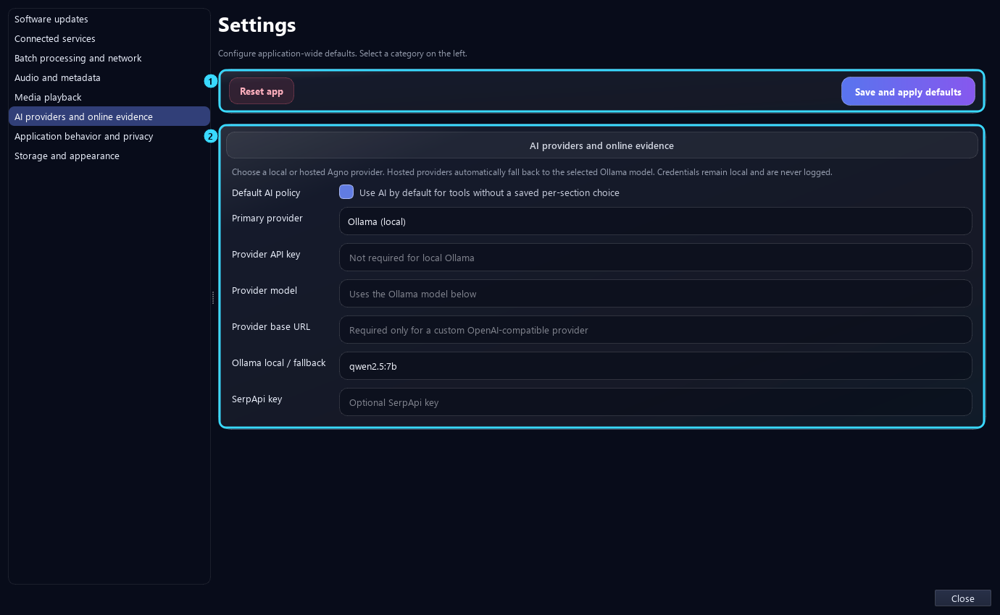

| Callout | Area | Use |
| --- | --- | --- |
| 1 | Settings actions | Apply the selected provider and credentials. |
| 2–4 | Other collapsed groups | Processing, audio, and playback defaults remain independent. |
| 5 | AI providers and online evidence | Choose the default AI policy, primary provider, provider-specific key/model/base URL, local Ollama fallback, and optional SerpApi key. |

Supported primary providers are Ollama, NVIDIA NIM, OpenAI, Anthropic, Google Gemini,
Groq, Hugging Face Inference, OpenRouter, OpenCode Zen, and a custom
OpenAI-compatible endpoint. Each provider retains its own draft key, model, and base
URL when the provider selector changes. Keys are password-masked and never printed in
operation logs.

- **Provider base URL** is normally filled automatically. Enter it for a custom
  OpenAI-compatible endpoint.
- **Ollama local / fallback** is the local model used directly when Ollama is primary or
  after a hosted provider fails.
- **SerpApi key** does not run a language model. It supplies optional Google Search and
  Google Images evidence when built-in catalog sources are insufficient.

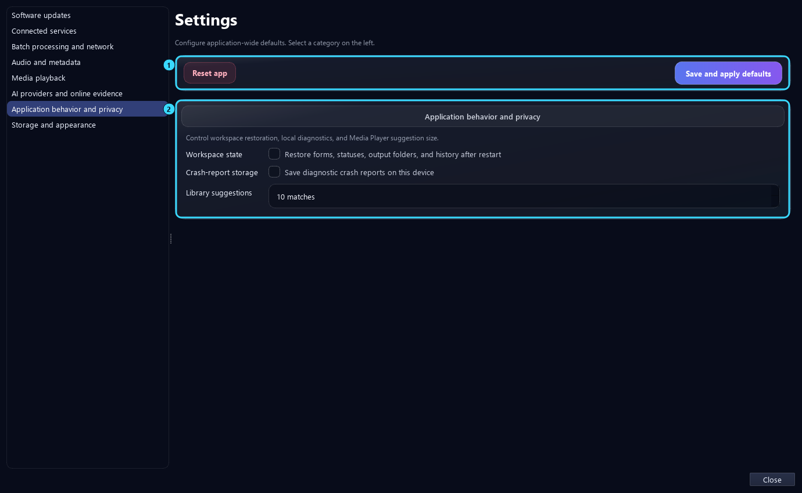

| Callout | Area | Use |
| --- | --- | --- |
| 1 | Settings actions | Save or reset. |
| 2–5 | Other setting groups | Expand any independent group without losing values in another. |
| 6 | Application behavior and privacy | Restore workspace state, opt into local crash reports, and set the Media Library suggestion count. |
| 7 | Storage and appearance | Move the application-data folder, open it, and tune the live glass “Crystalness” level. |

Changing the application-data folder safely copies existing application data and takes
effect on the next start. Crash reporting is local and opt-in. **Open data folder** opens
the exact active location.

## How AI and internet evidence work

AI is optional and never replaces the application's evidence and safety rules.

1. A workspace with **Use AI for this task** enabled may ask the selected provider to
   understand, preflight, extract, rank, or verify information.
2. A hosted-provider failure falls back to the configured Ollama model when available.
3. If neither model is usable, the workflow continues with deterministic rules and
   supported internet/catalog evidence where possible.
4. Ambiguous or conflicting identity evidence leaves a file unchanged for review.

The per-workspace switch controls model calls, not all network use. For example, Album
Splitter can still search Wikipedia, catalogs, cover sources, and YouTube when AI is
off. The footer and Live Logs identify the effective path:

- `[AI-PROVIDER]` — selected model provider used;
- `[AI-PROVIDER-FALLBACK]` — hosted provider failed and Ollama was tried;
- `[AI-NOT-USED]` — no model call was necessary;
- `[AI-STATIC-FALLBACK]` — deterministic processing continued without a model;
- `[AI-REVIEW]`, `[METADATA-REVIEW]`, or `[AGENT-REVIEW]` — safety rules left the
  item unchanged.

Provider and SerpApi requests may count against the user's own plan or quota.

## Use Dashboard

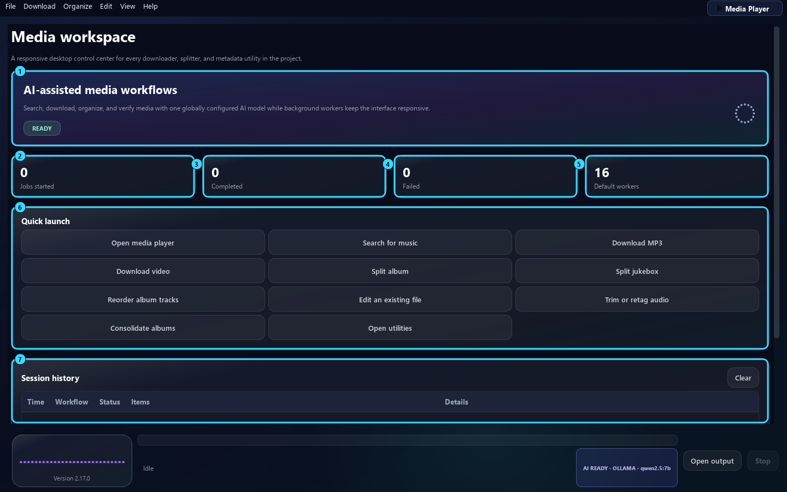

| Callout | Area | Use |
| --- | --- | --- |
| 1 | Readiness card | Shows whether the application is ready and summarizes AI-assisted background workflows. |
| 2 | Jobs started | Count of tasks started in this session. |
| 3 | Completed | Count of completed tasks. |
| 4 | Failed | Count of failed tasks. |
| 5 | Default workers | Current shared parallel-worker value. |
| 6 | Quick launch | Opens Media Library, Search Song, downloaders, splitters, Track Reorder, Edit File, Album Consolidator, or Utilities. |
| 7 | Session history | Shows time, workflow, status, item count, and detail. **Clear** removes displayed session history and counters, not media. |

Dashboard is a monitor and launcher. It does not contain media-job inputs. A background
job remains active if another page is opened.

## Find and download a song

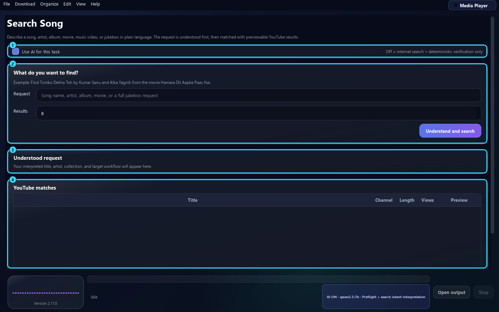

| Callout | Area | Use |
| --- | --- | --- |
| 1 | AI policy | Enable model-assisted request understanding or use deterministic internet search only. |
| 2 | Request | Describe a song, artist, album, film, video, or jukebox and choose 1–12 results. |
| 3 | Understood request | Review the interpreted title, artist, collection, and intended media type. |
| 4 | YouTube matches and routing | Preview a match, select one row, choose its destination workspace, then use the selected result. |

From scratch:

1. Enter identifying text such as song title, singers, film/album, language, or the fact
   that the request is a full jukebox.
2. Choose the maximum result count and select **Understand and search**.
3. Confirm the **Understood request**. If the identity is wrong, make the request more
   specific and search again.
4. In **YouTube matches**, compare title, channel, duration, and view count. Use **Play
   preview** when available.
5. Select exactly one row.
6. Choose **Audio Downloader (MP3 + metadata)**, **Video Downloader**, **Album
   Splitter**, or **Jukebox Splitter** under **Send selected result to**.
7. Select **Use selected result**, then verify every populated field on the destination
   page before starting work.

## Use Audio Downloader

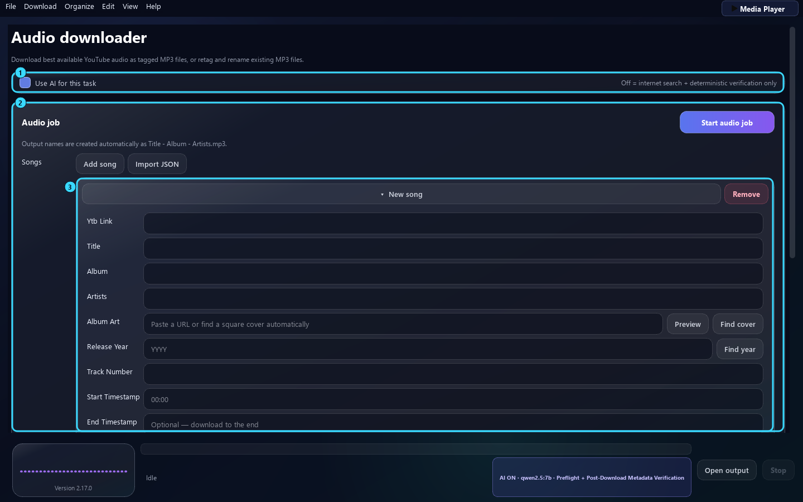

| Callout | Area | Use |
| --- | --- | --- |
| 1 | AI policy | Enables optional preflight and post-download metadata verification. |
| 2 | Audio job | Add/import songs, select download or retag mode, choose output, optional reporting, overwrite policy, and start. |
| 3 | Song editor | Expand/collapse or remove one song and edit all fields belonging to that item. |

### Download MP3 files

1. Select **Add song** for each item, or **Import JSON** for an existing batch.
2. Enter **Ytb Link**, **Title**, **Album**, comma-separated **Artists**, cover URL,
   release year, and optional track number.
3. Use **Start Timestamp** and **End Timestamp** to download a range. Accepted forms are
   seconds, `MM:SS`, or `HH:MM:SS`; a blank end means the end of the source.
4. Leave **Download · Enabled** on for items that should run. Disable it to keep a row in
   the batch without processing it.
5. Use **Preview** to inspect a cover URL, **Find cover** to search for a square image,
   and **Find year** to search release evidence.
6. Choose an optional output folder. Otherwise the saved default is used.
7. Leave **Write result report** off unless a machine-readable JSON summary is needed.
8. Decide whether an existing destination MP3 may be overwritten, then select **Start
   audio job**.

The output filename is generated from `Title - Album - Artists`. The saved MP3 receives
title, album, normalized artists, year, artwork, and track numbering. Download pacing,
retries, bitrate, sample rate, worker count, and connections come from Global Settings.
The activity card and Live Logs update during transfer; fragment lines include the
segment position when the source exposes it.

### Tag existing MP3 files

Change **Mode** to **Tag existing MP3 files**. The YouTube and download-range controls
are replaced by **MP3 File Path**. The app updates tags and the normalized filename
without downloading media. Review **Overwrite existing MP3 files** carefully when a
normalized destination already exists.

## Use Video Downloader

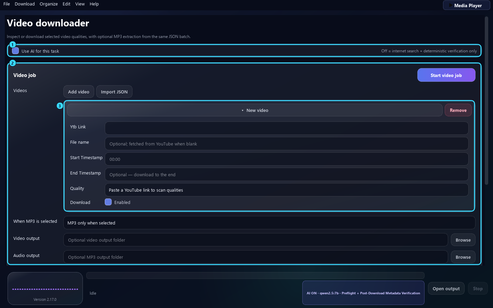

| Callout | Area | Use |
| --- | --- | --- |
| 1 | AI policy | Optional operation preflight and consistency checks. |
| 2 | Video job | Add/import video rows, select audio behavior, output folders, merge container, report, and overwrite policy. |
| 3 | Video editor | Paste the URL; title and available qualities are scanned automatically. Set optional range and enable/disable the row. |

1. Select **Add video** or **Import JSON**.
2. Paste **Ytb Link**. After a short pause the app scans the source, fills the file name
   when blank, and enables the available **Quality** choices.
3. Enter optional **Start Timestamp** and **End Timestamp** for a partial download.
4. If an MP3 format is selected, choose **MP3 only when selected** or **Selected video
   and MP3**.
5. Choose separate optional video and audio output folders.
6. Select the merge container: MP4, MKV, or WebM.
7. **Write result report** is disabled by default. Enable it only when a machine-readable
   batch result is useful.
8. Enable overwrite only when replacing an existing output is intentional.
9. Select **Start video job** and confirm the final path in Live Logs.

The connection strip represents actual yt-dlp transfer capability. Several blocks are
active for segmented DASH/HLS media; one block is active for a progressive source that
does not publish independently downloadable fragments. The app never invents per-part
percentages.

### Monitor downloads

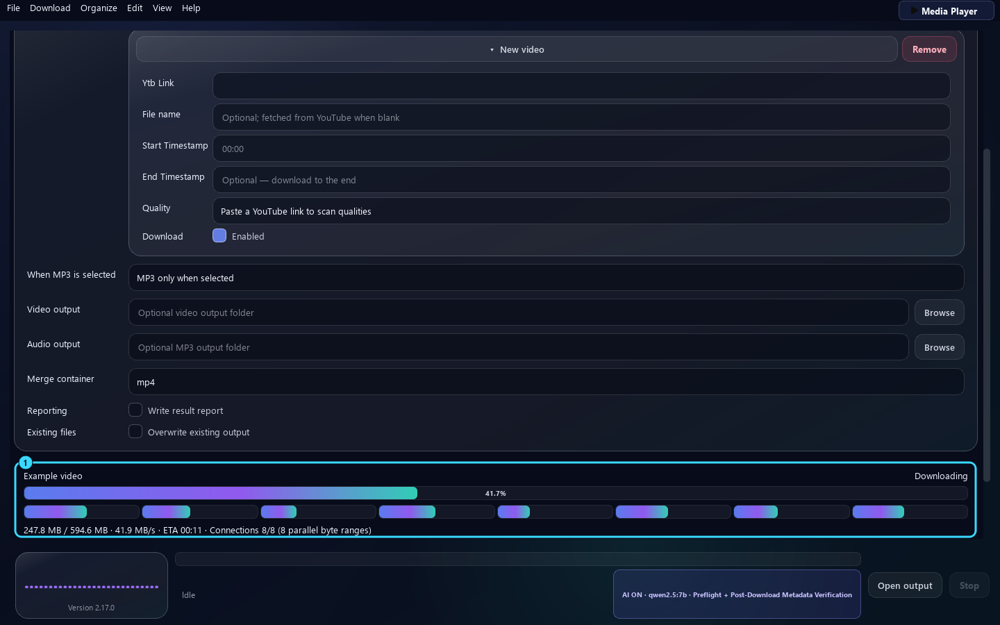

| Callout | Area | Use |
| --- | --- | --- |
| 1 | Download activity | Read overall percentage, downloaded/total size, speed, ETA, and active/available connection blocks. |

Audio Downloader, Video Downloader, Album Splitter, Jukebox Splitter, and the Edit File
replacement action use the same activity panel. **Live Logs** simultaneously receives
compact `[DOWNLOAD]` lines with the same values and a segment index/count when yt-dlp
exposes fragmented progress. The panel reports “single source stream” when the selected
source cannot use parallel fragments.

## Split an album or jukebox

Use **Album Splitter** for one release whose tracks share album metadata. Use **Jukebox
Splitter** for a mixed compilation in which each track may have a different album,
artist, year, and cover.

### Album Splitter

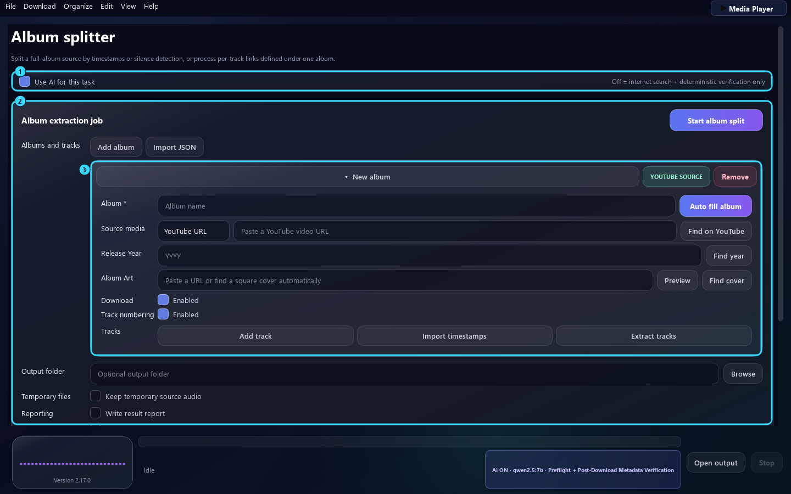

| Callout | Area | Use |
| --- | --- | --- |
| 1 | AI policy | AI on adds track-list extraction/validation; off keeps internet search and deterministic parsing. |
| 2 | Album extraction job | Add/import albums, choose output and silence controls, report/temp/overwrite behavior, then start. |
| 3 | Album editor | Enter the album identity; use full auto-fill or individual lookup buttons; add, import, extract, and review tracks. |

#### Automatically fill an album

This is the complete **Auto fill album** workflow:

1. Enter the album name. Include a four-digit year in the name when two releases share
   the same title; an explicitly entered year is treated as strong evidence.
2. Select **Auto fill album**.
3. The app searches online release evidence for the year, searches for square cover art,
   and searches YouTube for a suitable full-album/jukebox source.
4. When a full-album source is found, the app immediately extracts timestamped tracks
   and singer credits from its description. With the workspace AI switch on, the
   configured model assists extraction and the result is independently validated. With
   AI off, internet metadata and deterministic parsing are used.
5. If no suitable full-album video is found, the app searches for individual album-track
   links and builds per-track rows instead of inventing a jukebox URL.
6. The album row reports the stage—finding metadata, extracting tracks, completed, or a
   specific failure. Live Logs lists each source and fallback.
7. Review every populated value. Auto-fill is a starting point, not permission to skip
   identity, boundary, artist, and artwork checks.

Auto-fill can populate **Release Year**, **Album Art**, **Ytb Link**, and **Tracks**.
It does not select the final output/overwrite policy or approve the job on the user's
behalf.

#### Correct one field manually

- **Find on YouTube** searches for the first full-album result using album name/year and
  then starts track extraction.
- **Find year** searches Wikipedia release evidence.
- **Find cover** searches for a square cover; selecting it again excludes the current
  URL so another candidate can be found.
- **Preview** downloads at most the preview limit and opens the current HTTP(S) cover in
  a dialog without writing it to a media file.
- **Import timestamps** opens a preview-required parser dialog and adds all accepted
  rows.
- **Extract tracks** reads timestamp and singer information from the current YouTube
  description.
- **Add track** creates a blank row for manual title, source link, start/end, and artist.
- **Remove** deletes only that editor row, not a downloaded file.

If the extracted first track does not start at `00:00:00`, the app shows a warning.
Verify it manually because an incorrect first boundary shifts the entire album.

#### Album job controls

- **Download** disables an album or track without deleting its entered data.
- **Track numbering** writes sequential track tags when enabled.
- **Silence threshold**, **Minimum silence**, and **Minimum track** control fallback
  silence detection when explicit timestamps are unavailable.
- **Trim padding** retains a small amount around detected boundaries.
- **Keep temporary source audio** is useful for diagnosis but consumes extra disk space.
- **Write result report** records batch outcomes when explicitly enabled; it is disabled
  by default in every downloader and splitter.
- **Overwrite existing tracks** permits replacement; leave it off for the safest first
  run.

### Jukebox Splitter

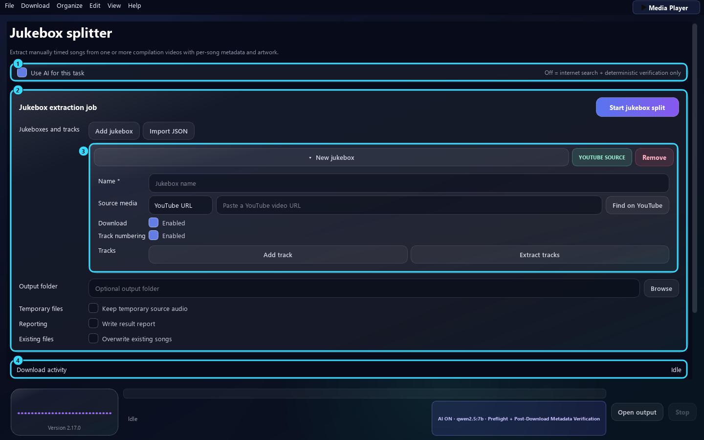

| Callout | Area | Use |
| --- | --- | --- |
| 1 | AI policy | Controls AI-assisted mixed-track extraction and metadata validation. |
| 2 | Jukebox extraction job | Add/import compilations, choose output/temp/report/overwrite behavior, and start. |
| 3 | Jukebox editor | Name the compilation, find/paste its link, enable numbering, then add or extract tracks. |
| 4 | Shared defaults reminder | Worker, retry, delay, bitrate, and sample-rate values come from Global Settings. |

Jukebox track rows contain **Start**, **End**, **Album**, **Artists**, **Album Art**, and
**Release Year** because the values may differ for every song. After extraction, each
track can use **Find album**, **Find artists**, **Find year**, **Find cover**, and cover
**Preview**. A catalog metadata lookup updates album, artists, year, and art as one
consistent unit instead of mixing unrelated results.

Mashup, remix, and lo-fi titles are not blindly auto-enriched as ordinary releases.
Review all boundaries and identities before selecting **Start jukebox split**.

### Timestamp import dialog

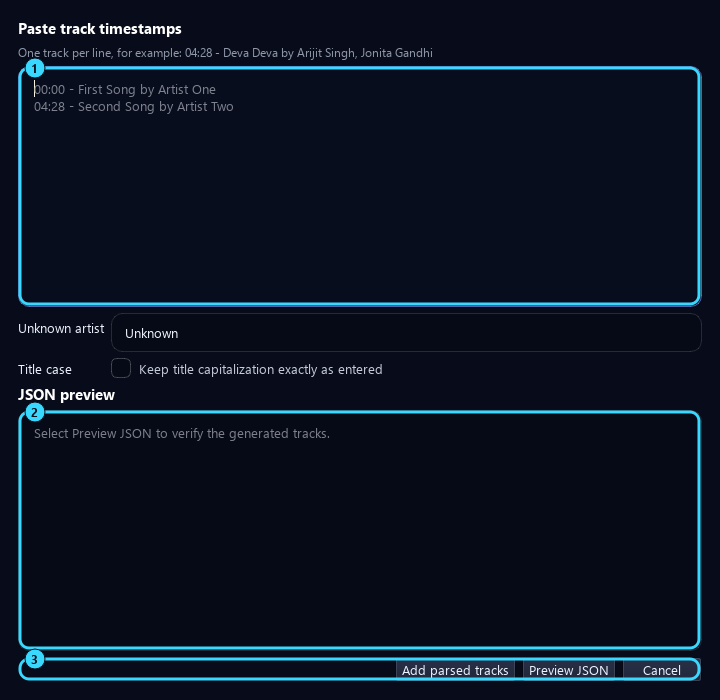

| Callout | Area | Use |
| --- | --- | --- |
| 1 | Timestamp text | Paste one timestamped track per line. Add `by Artist` when known. |
| 2 | JSON preview | Inspect the exact structured tracks after selecting **Preview JSON**. |
| 3 | Dialog actions | **Add parsed tracks** stays disabled until a successful preview; Cancel leaves the album unchanged. |

The title-case option controls whether the parser normalizes casing. **Unknown artist**
is used only where a line supplies no artist. In Utilities, choose an `end` field for a
jukebox or `stop` for an album according to the destination JSON format.

## Reorder an album

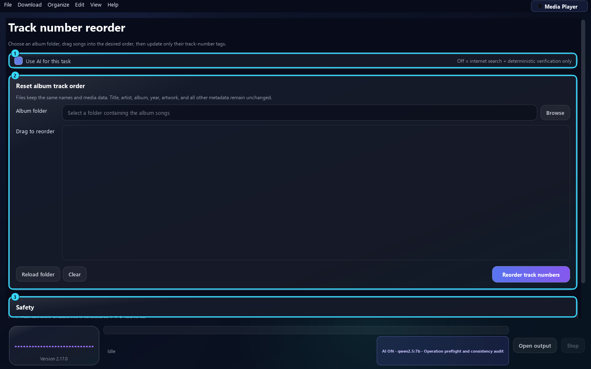

| Callout | Area | Use |
| --- | --- | --- |
| 1 | AI policy | Optional preflight; reordering itself changes only deterministic track-number tags. |
| 2 | Reorder form | Browse an album folder, drag rows, reload/clear, and apply the order. |
| 3 | Safety summary | Confirms what remains unchanged. |

1. Browse to one album folder. Supported media files load automatically.
2. Drag tracks into the intended order. The displayed `01`, `02`, and so on update as
   rows move.
3. Use **Reload folder** to discard the unsaved arrangement and read the folder again.
4. Use **Clear** to clear the selected folder and list without touching files.
5. Select **Reorder track numbers**.

Only the track-number tag changes to 1, 2, 3, and so on. An existing track total such as
`/8` is preserved. Files are not renamed, moved, decoded, or re-encoded, and title,
artist, album, year, and artwork remain unchanged.

## Edit a local media file

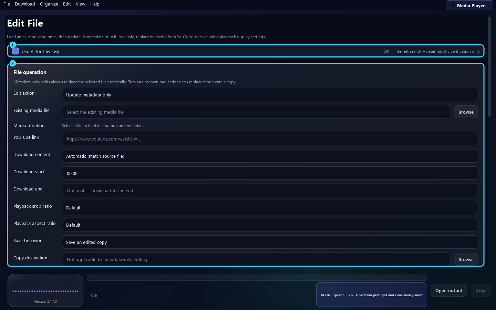

| Callout | Area | Use |
| --- | --- | --- |
| 1 | AI policy | Optional preflight/verification for supported edit operations. |
| 2 | File operation | Select the action, source file, source/download ranges, crop/aspect, and save behavior. |
| 3 | Song metadata | Review loaded tags and artwork behavior, then run the action. |

Browse to an existing audio or video file. Duration and current metadata load
automatically.

### Update metadata only

Edit title, album, comma-separated artists, year/date, track number/total, and artwork.
An empty metadata field removes that tag. A blank artwork input preserves the current
cover; **Remove existing artwork** deletes it. Metadata changes are written to a
temporary copy and atomically replace the source. Edited audio is renamed safely as
`Title - Album - Artists`.

### Trim the selected local file

Set **Local trim start/end** inside **Song metadata**. This trims the already-downloaded
file and does not use YouTube. Choose **Save an edited copy** and a destination, or
**Replace the existing source file**. Trimming uses stream copy where supported, then
applies the edited metadata.

### Replace media from YouTube

Enter the link and choose Automatic, Audio only, Video only, or Audio and video. The
upper **Download start/end** range limits the replacement download and is independent of
the lower local-trim range. Choose copy or replacement behavior and verify the proposed
destination before selecting **Redownload and edit**.

### Save a video playback crop / aspect profile

Choose **Playback crop ratio**, **Playback aspect ratio**, or both, then select **Save
playback settings**. These values are application metadata stored by the Media Library
for that video path. The video is not re-encoded, cropped, renamed, or written to in any
way, and its encoded dimensions and original pixels remain unchanged.

Every time that video plays, the saved crop/aspect is applied by the player to control
how it fills the available viewing area. Other videos keep their own profiles or use the
normal defaults. Opening this action from the active player copies its current Crop and
Aspect selections into the editor. Saving both values as **Default** removes the profile.

The Media Library can open a selected track directly in Edit File. A video context menu
also exposes the playback crop/aspect profile action.

## Edit an album folder

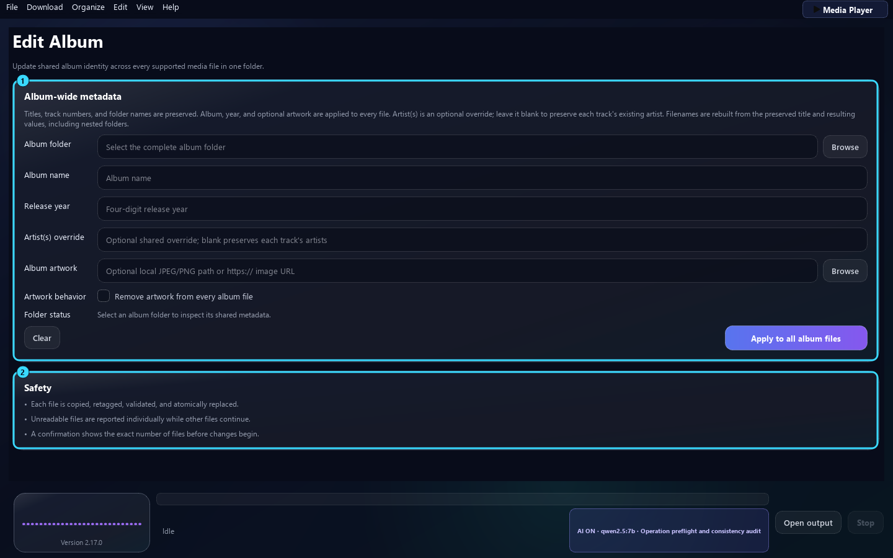

| Callout | Area | Use |
| --- | --- | --- |
| 1 | Album edit form | Browse the folder, review status, enter shared values/artwork behavior, clear, or apply. |
| 2 | Bulk-edit contract | Explains preserved tags, per-track artists, renaming, and atomic writes. |

1. Browse one album folder and select **Load album** if it has not loaded automatically.
2. Review the detected file count, artwork coverage, and current album/year/artist
   values. Mixed values are shown as mixed instead of silently choosing one.
3. Enter the required album name and an optional four-digit year.
4. Leave **Artist(s) override** blank for soundtracks, compilations, or albums with
   different track artists. Each file keeps its own artist. Enter artists only when the
   same replacement should be written to every track.
5. For artwork, choose a local JPEG/PNG or HTTPS URL, select **Remove artwork from every
   album file**, or leave both blank to preserve each existing cover.
6. Select **Apply to all album files** and confirm the folder-level change.

Titles and track numbers remain unchanged. The dedicated album-artist tag is preserved.
Each filename is safely rebuilt from the updated album identity and resulting per-track
artist. Each file is written through a temporary copy; failures are listed individually.

## Enrich and organize an existing music folder

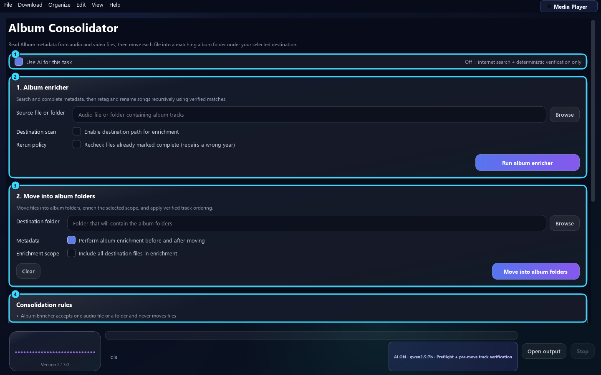

| Callout | Area | Use |
| --- | --- | --- |
| 1 | AI policy | Enables optional metadata and pre-move identity verification. |
| 2 | Album enricher | Repair metadata recursively without moving files. |
| 3 | Move into album folders | Choose destination and enrichment scope, then route approved files. |
| 4 | Consolidation rules | On-screen summary of matching, naming, duplicate, skip, and ordering rules. |

Album Consolidator has two intentionally separate stages.

### Stage 1: Album enricher

1. Select the source folder containing incoming tracks.
2. **Enable destination path for enrichment** only when the destination should also be
   part of the enrichment scan.
3. Enable **Recheck files already marked complete** to repair a previously accepted but
   wrong value such as year. Otherwise the tracker avoids repeating completed work.
4. Select **Run album enricher**.
5. Inspect `[ENRICHED]`, `[METADATA-REVIEW]`, and `[ENRICH-SKIPPED]` lines. Correct an
   unresolved file in Edit File or rerun when better evidence is available.

Enrichment searches built-in sources such as Wikipedia and Apple's catalog. With a
SerpApi key, Google Search and Images are fallbacks when built-in evidence is
insufficient. AI can verify identity but cannot override missing or conflicting required
metadata. Artist names are canonicalized during downloads and enrichment: dotted
initials lose periods (`K.K.` → `KK`, `A. R. Rahman` → `AR Rahman`) and a shortened name
expands only when the identity is known or unambiguous.

### Stage 2: Move into album folders

1. Select the destination library folder.
2. Leave **Perform album enrichment before and after moving** enabled when this stage
   should verify/enrich metadata. Disable it after a completed stage 1 to route existing
   tags without repeating enrichment. Track indexing still runs.
3. Enable **Include all destination files in enrichment** only when enrichment is on and
   the complete destination tree should be included.
4. Select **Move into album folders**.

Approved files go to `Album (Year)` folders. Existing album folders are reused and
existing files are not overwritten. Unresolved files remain in the source. A source
file whose normalized title already exists in the matching destination is treated as a
duplicate and may be deleted, so keep a backup until matching has been verified.

### Why a track may remain in the source

- album, title, artist, year, or required artwork is blank;
- catalog/internet candidates conflict or duration evidence does not match;
- a model or deterministic verifier requested review;
- SerpApi was missing, rejected, quota-limited, or returned no independently agreeing
  exact result;
- the album value contains an artist credit or invalid placeholder;
- the file or metadata could not be read.

The final per-file Live Logs message is authoritative.

## Use Utilities

Utilities contains two tabs and an independent AI policy switch. Formatting and parsing
are deterministic; AI may be used only by supported preflight/review paths.

### Artist formatter

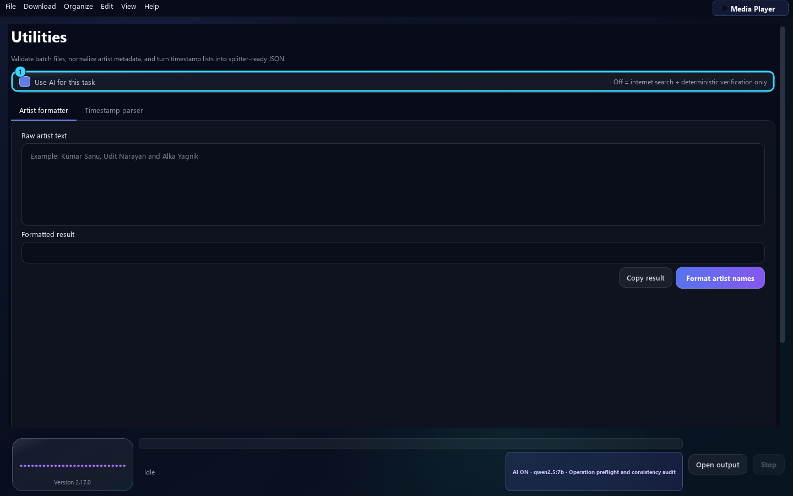

Callout 1 contains the complete tab. Paste raw credits such as comma-, `and`-, or
separator-delimited names, select **Format artist names**, then **Copy result**. Initials
are normalized without periods and known naming rules are applied without treating every
bare given name as a specific person.

### Timestamp parser

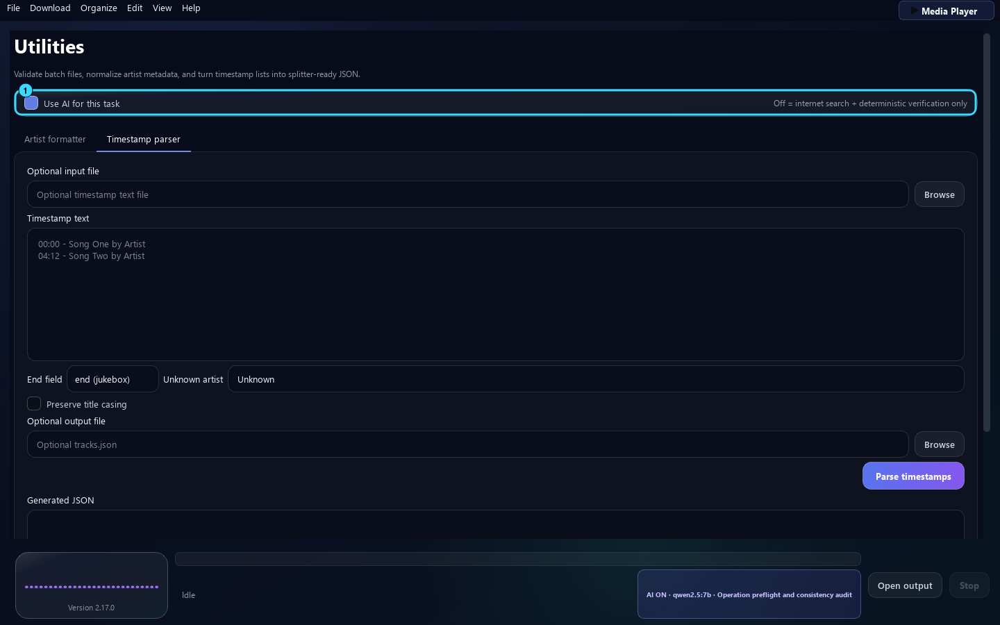

Callout 1 contains the complete tab:

1. Optionally browse to a text file or paste timestamp lines directly.
2. Choose `end (jukebox)` or `stop (album)` for the generated boundary field.
3. Set the placeholder artist for lines without credits.
4. Choose whether to preserve the supplied title casing.
5. Optionally choose an output JSON path.
6. Select **Parse timestamps** and review **Generated JSON** before importing it into a
   splitter.

## Use the local media library

Media Library scans user-selected folders, derives a local index, browses artists and
albums, filters all media, plays audio/video, manages a persistent queue and playlists,
offers AI-assisted local curation, and optionally serves a phone client over trusted
same-Wi-Fi access.

### Add, scan, search, and browse

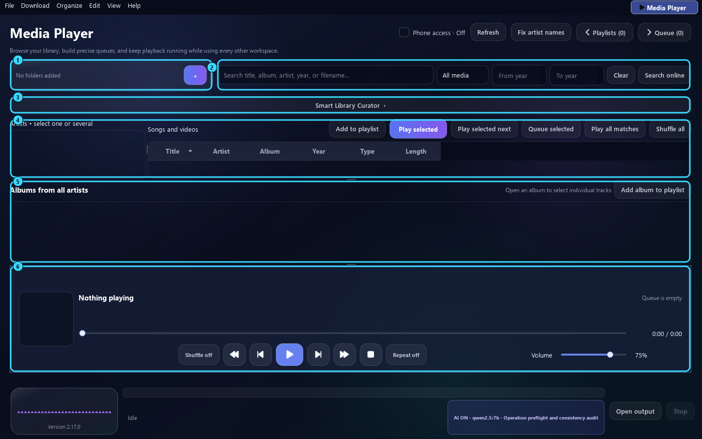

| Callout | Area | Use |
| --- | --- | --- |
| 1 | Library folders | Add folders with `+`; chips scroll horizontally and each `×` removes that folder from the index. |
| 2 | Search and filters | Search any indexed text, choose All media/Music/Videos, enter numeric From/To years, clear text/years, or search online. |
| 3 | Smart Library Curator | Expand the natural-language local-library assistant. |
| 4 | Artists and matching tracks | Multi-select artists, sort/select tracks, switch video view, add/play/queue selected items, play matches, or shuffle. |
| 5 | Albums | Browse all or selected-artist albums, open one, add it to a playlist, and use album actions. |
| 6 | Player | Artwork/video, title, queue status, timeline, transport controls, volume, and video-only display controls. |

1. Select `+` and add one or more library folders. Folder chips use 30% of the compact
   top row and scroll horizontally; the search area uses the remaining 70%.
2. Select **Refresh** after external file/tag changes. The scan updates titles and column
   widths from the current metadata rather than preserving stale long values.
3. Search across title, album, artist, year, and filename. **From year** and **To year**
   accept digits only, and To must be greater than or equal to From.
4. **Clear** resets search text and both year fields but preserves the explicitly chosen
   All media/Music/Videos filter.
5. Selecting one or several artists filters tracks and albums. Use **All tracks** or
   **All albums** to clear that specific selection.
6. Drag the divider between Artists and Tracks, between the browser and Albums, and
   between the library browser and player. Sizes are remembered.
7. Table columns recalculate to the largest visible value whenever the album, artist,
   search, or filter result changes.

In Videos mode the album browser hides so the video list and cinema player receive the
space. **Thumbnails view** displays larger 16:9 preview tiles; **List view** shows Title,
Artwork, Artist, Album, Year, Type, and Length. Selection and actions persist when
switching views. A preview uses embedded artwork first, otherwise a representative frame
is extracted without modifying the video.

### Smart Library Curator

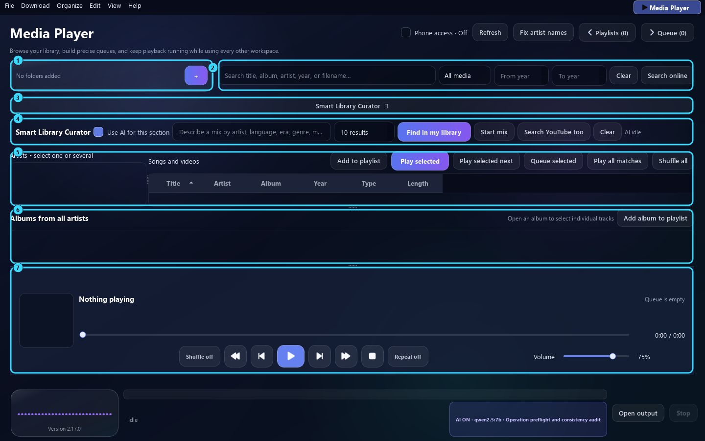

| Callout | Area | Use |
| --- | --- | --- |
| 1–2 | Folder and broad filters | Define the locally indexed/filterable scope. |
| 3 | Curator request | Enable AI, describe a mix, set result count, find locally, start a mix, search YouTube explicitly, or clear. |
| 4–7 | Browser, albums, and player | Curator results feed the same selection, playlist, queue, and playback controls. |

Enter a request such as `latest Arijit Singh Hindi dance songs`, `old Bengali songs`, or
`return 5 calm tracks`. With AI on, the desktop model plans constraints and ranks only
IDs already present in the scanned library. Language, mood, style, activity, energy, and
tempo remain evidence gates; unsupported model claims are rejected.

- **Find in my library** returns exact verified local matches.
- A number in the request overrides the result-count control.
- **Start mix** plays exact matches, then adds evidence-verified related local tracks.
- Saved playlist names and songs act as bounded taste examples for every request; model
  weights are not retrained.
- **Search YouTube too** is explicit and never automatic. Local file paths are never
  placed in AI or online-search context.
- With AI off, the action becomes a plain internet search instead of local semantic
  curation.

### Repair artist names

Select **Fix artist names** to scan all configured library tracks. Placeholder Unknown
credits are ignored. The app proposes period-free initials, known aliases, and
unambiguous longer identities, then waits for review.

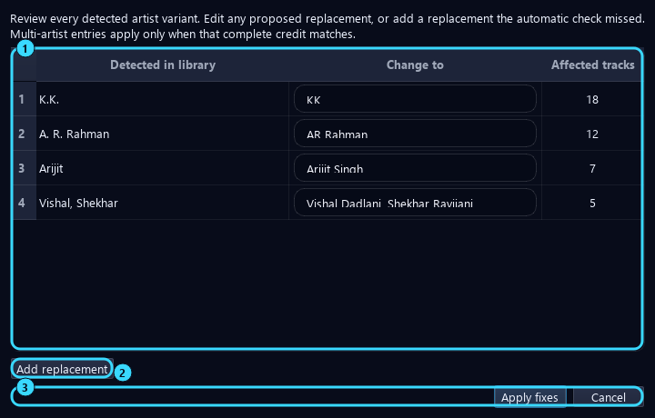

| Callout | Area | Use |
| --- | --- | --- |
| 1 | Detected repairs | Review source spelling, editable replacement, and affected-track count. |
| 2 | Add replacement | Add a complete credit the automatic pass missed. |
| 3 | Apply or cancel | Apply all reviewed mappings or leave every file unchanged. |

`Vishal, Shekhar` can safely map as a complete credit to `Vishal Dadlani, Shekhar
Ravjiani`; bare `Vishal` is not automatically changed because it may refer to Vishal
Mishra or another artist. User-added mappings show their match count before application.
After **Apply fixes**, affected metadata is updated and the library refreshes.

### Playlists

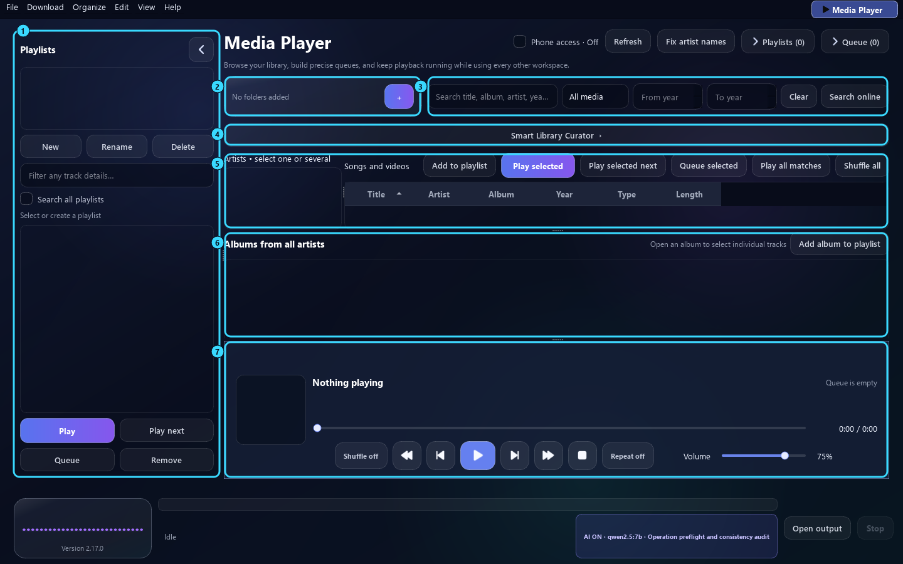

| Callout | Area | Use |
| --- | --- | --- |
| 1 | Playlist drawer | Create, rename, delete, filter, select, and close playlists. |
| 2–7 | Main library areas | Search/browse while the resizable drawer remains open. |

Create a playlist, then use track/album/artist context menus or **Add to playlist**.
When a path is already present, choose **Skip duplicates** to add only new selections or
**Add anyway** to keep another occurrence.

- Drag playlist tracks to reorder them. The exact order is persisted immediately.
- The filter searches title, artist, album, year, filename, and other indexed text.
- **Search all playlists** returns matching tracks across every created playlist.
- Right-click a playlist track to Edit File, add it elsewhere, or remove it.
- Play, queue, and remove actions operate on the selected playlist rows.
- Drag the divider beside the drawer to resize it; the width is remembered.

### Permanently delete library media

Right-click a song, video, table selection, playlist track, or currently playing item
and choose **Permanently delete file(s)…**. The confirmation lists the selected files,
states that deletion cannot be undone, and defaults to **No**. After confirmation the
app stops an affected current item, removes deleted paths from the queue and every
playlist, removes saved video-display profiles, deletes the files from disk, and
refreshes the library.

Right-click an album and choose **Permanently delete album songs…** to delete every
indexed media item whose album tag matches that album—not merely the rows currently
visible under a search/year filter. When those tracks span multiple physical folders,
the confirmation becomes a prominent warning and lists the folders before allowing the
operation. Only indexed album media files are deleted; the app does not recursively
delete folders, cover art, or unrelated files. Any failed file remains on disk and is
reported separately.

### Now Playing queue

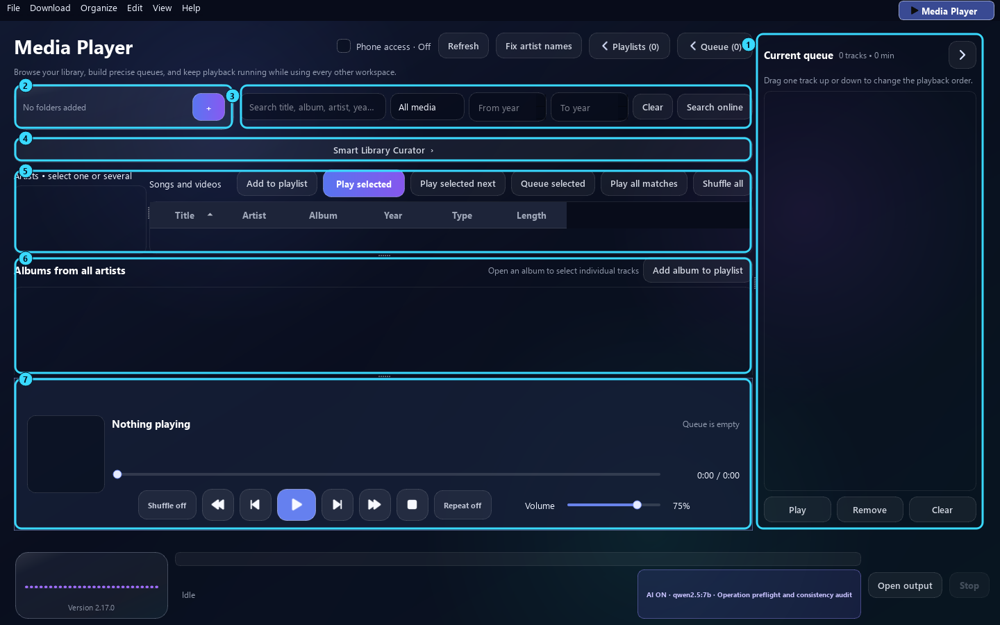

| Callout | Area | Use |
| --- | --- | --- |
| 1–6 | Main library | Browse and add more media without stopping playback. |
| 7 | Current queue | Drag tracks into playback order, play a selection, remove it, or clear the queue. |

The queue order is independent of playlist order. Previous/Next follow the queue. Drag
its divider to resize the drawer; the width is remembered.

### Player controls

Transport controls are ordered **Shuffle, Backward, Previous, Play/Pause, Next,
Forward, Stop, Repeat**. Backward and Forward use solid double-triangle icons and the
Global Settings seek interval. Video adds **Aspect**, **Crop**, and **Full screen**;
those controls are hidden for audio.

- Clicking anywhere on the seek slider jumps/animates to that position.
- Clicking anywhere on the volume slider sets that volume rather than moving by a small
  step. The percentage appears after the slider.
- In embedded video, Aspect and Crop open dropdown menus for a direct choice.
- In full screen, each Aspect or Crop click cycles to the next option.
- Repeating/restarting the same video preserves its current crop/aspect until another
  track is loaded or playback is explicitly stopped and started.

**Aspect** options: Default, 16:9, 4:3, 1:1, 16:10, 2.21:1, 2.35:1, 2.39:1, 5:4.

**Crop** options: Default, 16:10, 16:9, 4:3, 1.85:1, 2.21:1, 2.35:1, 2.39:1,
5:3, 5:4, 1:1.

Double-click video or select **Full screen** for a borderless monitor-sized surface.
Controls slide up when the mouse moves and hide while watching. Crop-to-fill uses the
complete screen while the overlay is hidden. Double-click, select **Exit full screen**,
or press Esc to return. Full-screen controls use the same theme and behavior as embedded
controls. The transport controls remain horizontally centered against the complete
screen, while the volume controls stay aligned to the right.

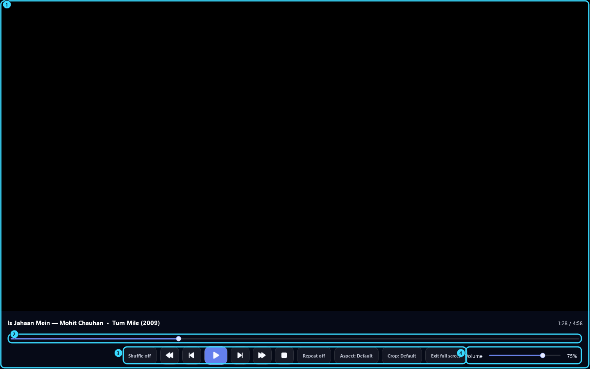

| Callout | Area | What it does |
| --- | --- | --- |
| 1 | Video surface | Uses the complete borderless playback area while the overlay is hidden. |
| 2 | Playback heading and timeline | Shows the active title, elapsed time, duration, and clickable seek position. |
| 3 | Centered transport controls | Keeps Shuffle through Exit full screen centered in every full-screen layout. |
| 4 | Volume controls | Changes volume independently at the right edge and shows the current percentage. |

| Key | Action |
| --- | --- |
| `F` | Enter or leave full screen. |
| `Esc` | Leave full screen. |
| `Space` | Play or pause. |
| `M` | Mute or unmute. |
| `S` | Stop. |
| `N` / `P` | Next / previous queue track. |
| `A` / `C` | Cycle aspect / crop. |
| `Right` / `Left` | Seek by the configured interval. |
| `Shift+Right` / `Shift+Left` | Seek by twice the interval. |
| `Home` or `0` | Jump to the beginning. |
| `1` through `9` | Jump to 10% through 90%. |

Keyboard playback controls activate only when playback—not a search/edit field—has
focus.

### Use the Media Library from a phone

1. Connect PC and phone to the same trusted Wi-Fi.
2. Turn **Phone access** on. Select **Details**, open a displayed address in a current
   iOS or Android browser, and enter the six-digit PIN.
3. Browse Songs, Albums, and Playlists. Broad text/year/type filters run on that phone.
4. **Phone** streams a selected local file to the phone. **PC** starts it on desktop.
   **Queue** appends it to the desktop queue.
5. Create playlists, add/remove tracks, and drag or use arrow controls to reorder. Every
   mutation is saved by the desktop immediately and synchronized to other clients.
6. Use Curator to send a natural-language request to the desktop. The PC uses its local
   index, configured AI/evidence sources, and compute.
7. Turn Phone access off to stop the LAN server and disconnect clients. Active phone
   playback is terminated rather than continuing until the browser closes.

The server prefers port 8765 and selects a fallback when needed. It is PIN/token
protected, rate-limits failed PIN attempts, never exposes local paths, and serves only
files in the published library snapshot. It is plain HTTP for a trusted private LAN;
do not port-forward it or use it on an untrusted network.

## Read Live Logs

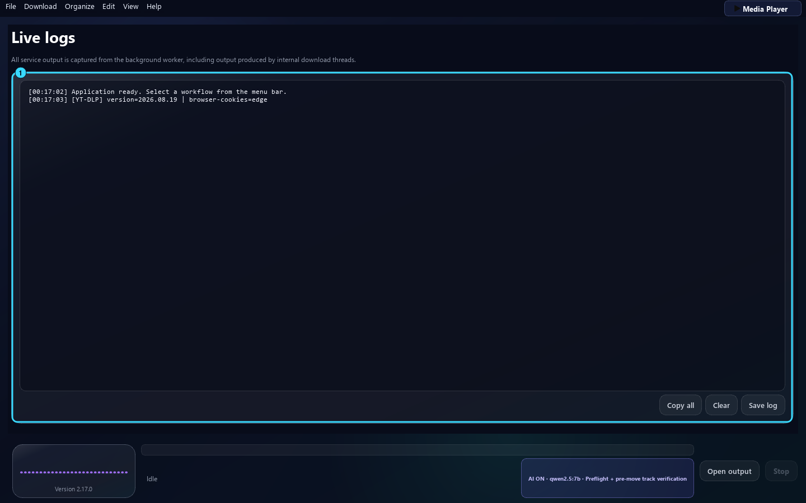

Callout 1 contains the no-wrap log viewer and **Copy all**, **Clear**, and **Save log**
actions. Clear affects displayed log text only.

| Marker | Meaning |
| --- | --- |
| `[START]` / `[PROGRESS]` | A task began or is still processing. |
| `[COMPLETE]` | The task ended; compare processed and skipped counts. |
| `[ENRICHED]` / `[MOVED]` | Metadata was written or a file was routed. |
| `[SKIPPED]` / `[ENRICH-SKIPPED]` | No change was intentionally made; the line says why. |
| `[AI-VERIFIED]` | Model evidence supported identity; completeness rules still apply. |
| `[AI-REVIEW]` / `[METADATA-REVIEW]` | Evidence was ambiguous or incomplete. |
| `[AGENT-REVIEW]` | An AI-enabled safety gate did not approve the file. |
| `[AI-PROVIDER-FALLBACK]` | The selected provider failed and fallback was attempted. |
| `[SERPAPI-MATCH]` / `[SERPAPI-NO-MATCH]` | Google evidence met or failed exact rules. |
| `[SERPAPI-UNAVAILABLE]` | Optional SerpApi request failed; the key is not printed. |
| `[ERROR]` / `[FAILED]` | The item could not finish; preserve surrounding lines. |

`[COMPLETE]` is the end of a task, not a guarantee that every input changed.

## File-safety rules

- Existing destination files are not overwritten unless the relevant overwrite option
  is explicitly enabled.
- Unresolved Album Consolidator inputs stay in their source folder.
- A confirmed duplicate in an existing destination album may cause the incoming source
  duplicate to be deleted; keep backups while validating matches.
- Folder names and generated filenames are sanitized for the current operating system.
- Metadata edits use temporary files and atomic replacement where the workflow promises
  it.
- Video playback crop/aspect profiles are app metadata; they never crop, re-encode, or
  replace the media file.
- Changing pages does not cancel work. Use **Stop** and confirm the log result.
- Do not close the app or edit/delete active input files until cancellation or completion
  is recorded.

## Troubleshooting

1. Open Live Logs and copy the block from `[START]` through `[COMPLETE]` or `[FAILED]`.
2. Distinguish an intentional skip/review from an actual error.
3. Confirm source and destination paths exist and are writable.
4. Load a suspect file in Edit File and inspect title, album, artists, year, track data,
   artwork, and duration.
5. If AI was enabled, retry with it off to compare deterministic behavior. If a hosted
   provider failed, verify its key/model or the configured Ollama fallback.
6. For an online lookup failure, confirm connectivity and any SerpApi quota without
   publishing the key.
7. Include the displayed application version, operating system, complete log block,
   current metadata, and expected result in a report. Do not publish credentials,
   unwanted private paths, or copyrighted media.

For command-line diagnostics and installer development, see the
[README troubleshooting section](../README.md#troubleshooting).

Documentation maintainers must update affected text and screenshots whenever a UI
change makes an image or explanation inaccurate. See the
[screenshot maintenance rule](SCREENSHOT_MAINTENANCE.md).
