# Workflow designs

These diagrams describe runtime behavior. The [low-level design](LOW_LEVEL_DESIGN.md)
identifies the owning modules and classes.

## 1. Desktop operation lifecycle

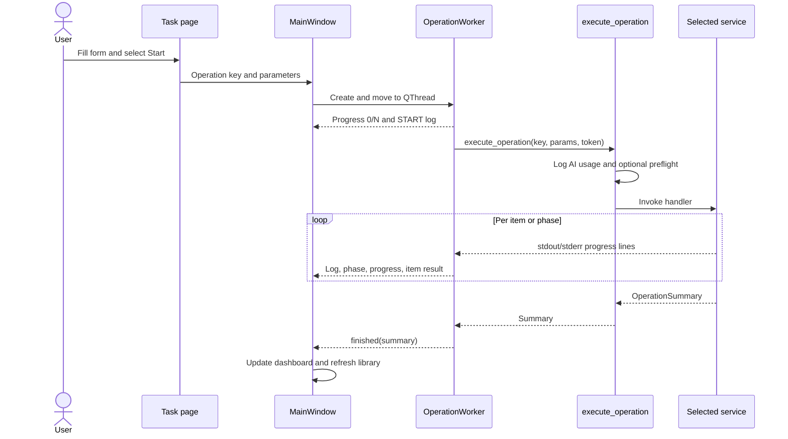

## 2. Per-entry Audio Downloader

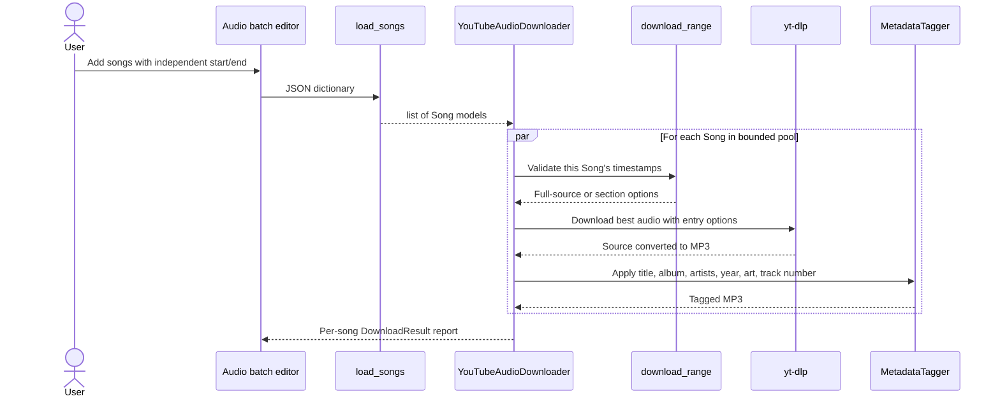

Tag-existing mode hides source and timestamp fields because it changes tags and names
without downloading or trimming media.

## 3. Per-entry Video Downloader

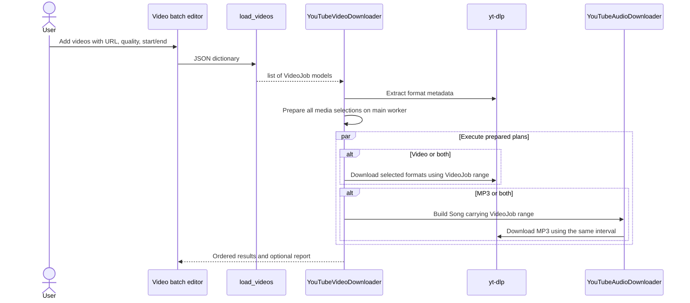

## 4. Album and jukebox splitting

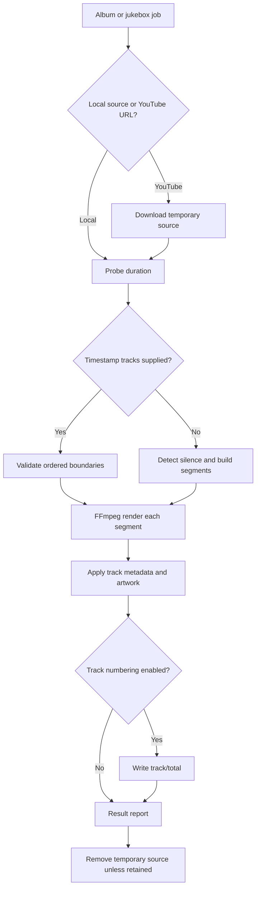

Jukebox splitting subclasses the album splitter and adds compilation-oriented metadata
and output organization.

## 5. Metadata enrichment and album consolidation

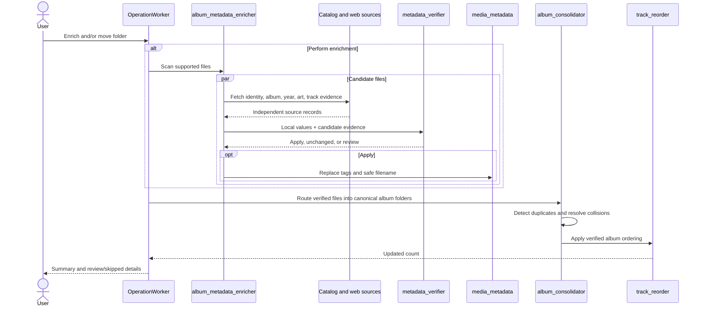

When **Perform album enrichment** is disabled, consolidation skips the repeated evidence
pass but still routes files and applies available verified indexing.

## 6. Edit File and Edit Album

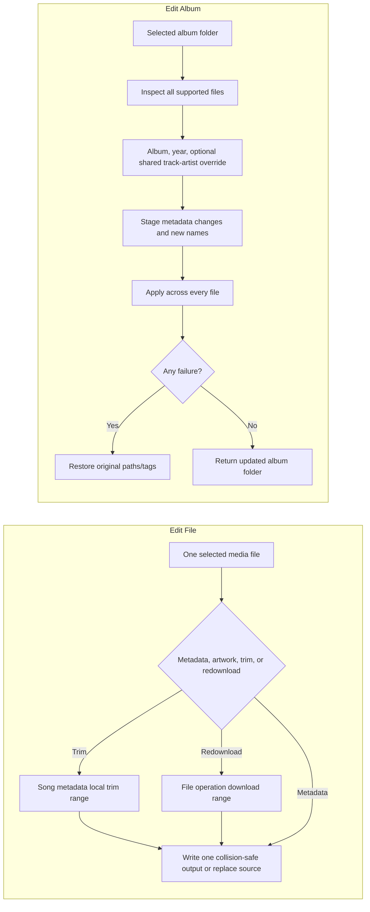

Edit Album changes the normal artist tag only when a shared **Artist(s) override** is
entered; it never changes the separate compilation-only album-artist value. When the
override is blank, every file keeps its own track artist, making soundtrack and compilation
folders safe to update. Titles and track numbers are preserved while filenames are rebuilt
from the title, new shared album identity, and each resulting track artist.

## 7. Media Library scan, filter, and browse

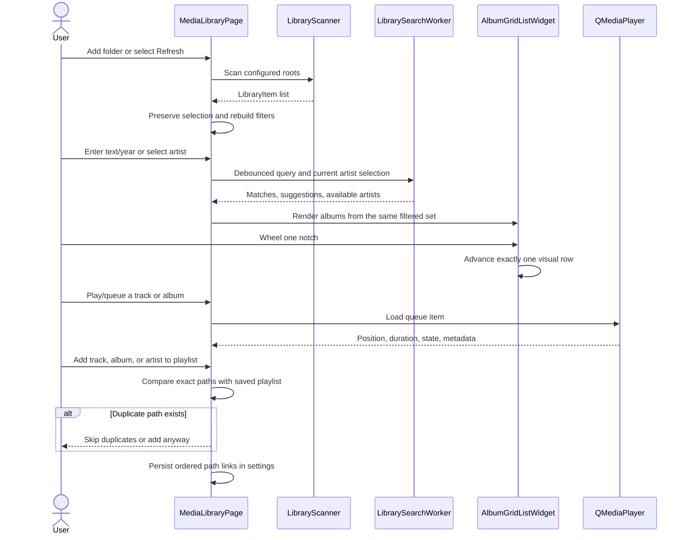

### LAN phone synchronization

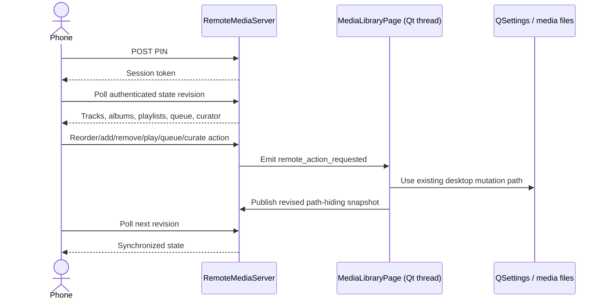

Media streaming accepts byte ranges for browser seeking but only resolves opaque IDs in
the current server allowlist. Search filters execute in each phone client; curator actions
execute through the desktop's configured AI and evidence stack.

## 8. Smart Library Curator multi-agent flow

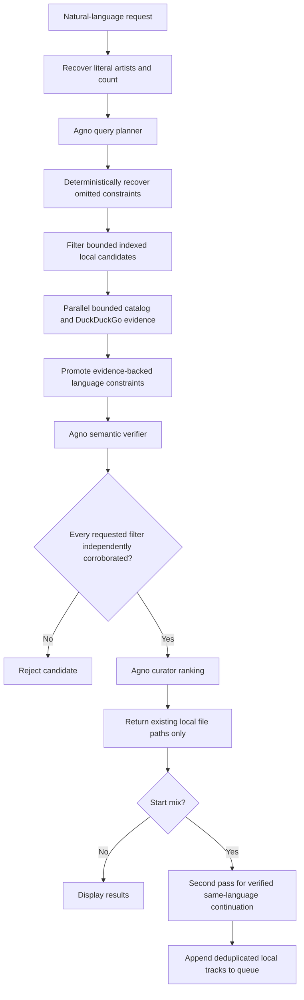

Language cannot be inferred from artist nationality. Mood, activity, style, energy, and
tempo require an exact supporting evidence phrase (or an independently adjudicated close
musical synonym) for the same recording.

## 9. AI provider fallback

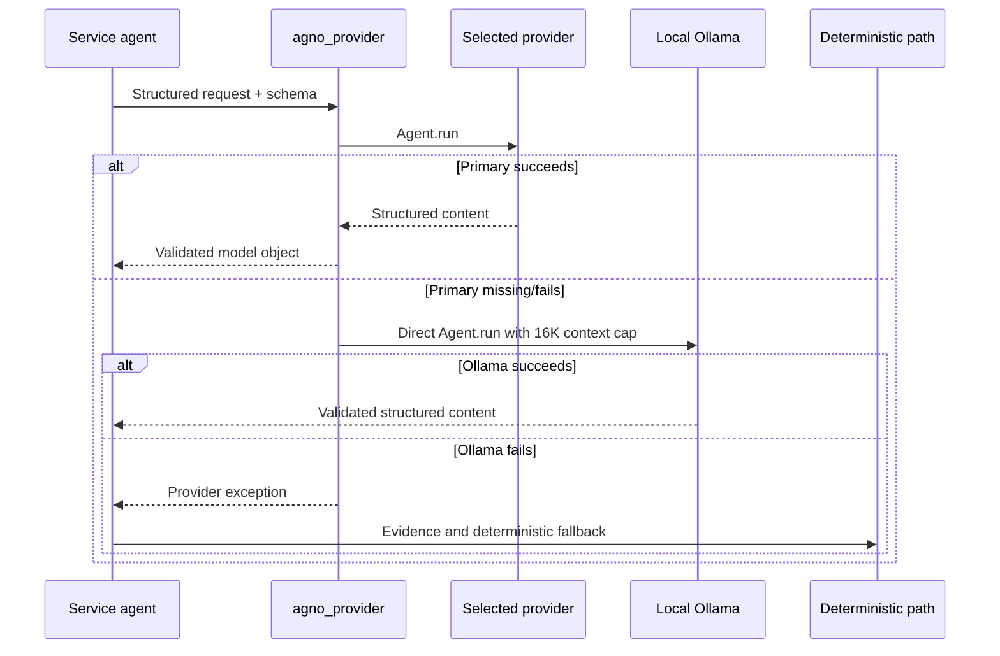

## 10. Playback queue state

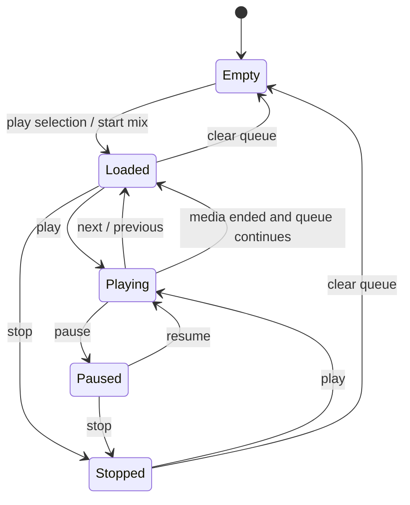

Shuffle stores an authoritative source order so it can be disabled without losing queue
identity. Repeat supports off, one, and all. Queue reordering preserves the current track
by path rather than by row number.

## 11. Cancellation and failure handling

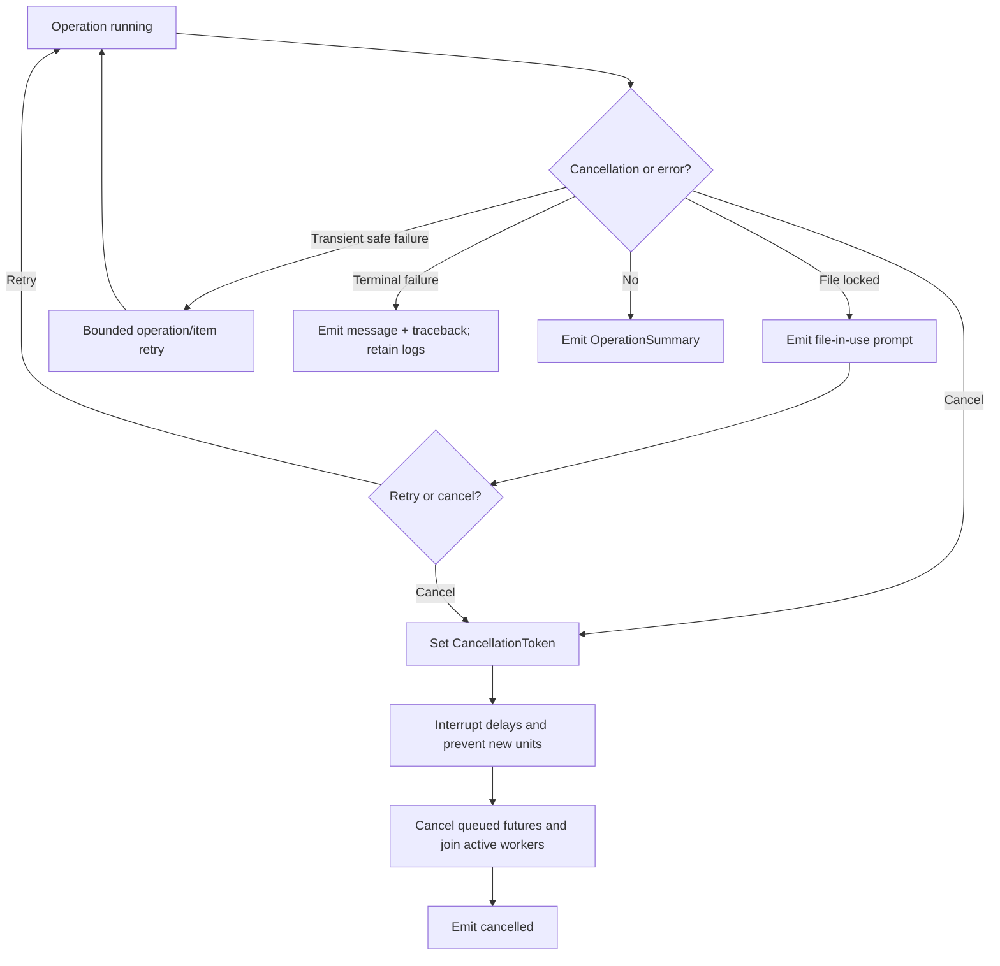

## 12. Build and release flow

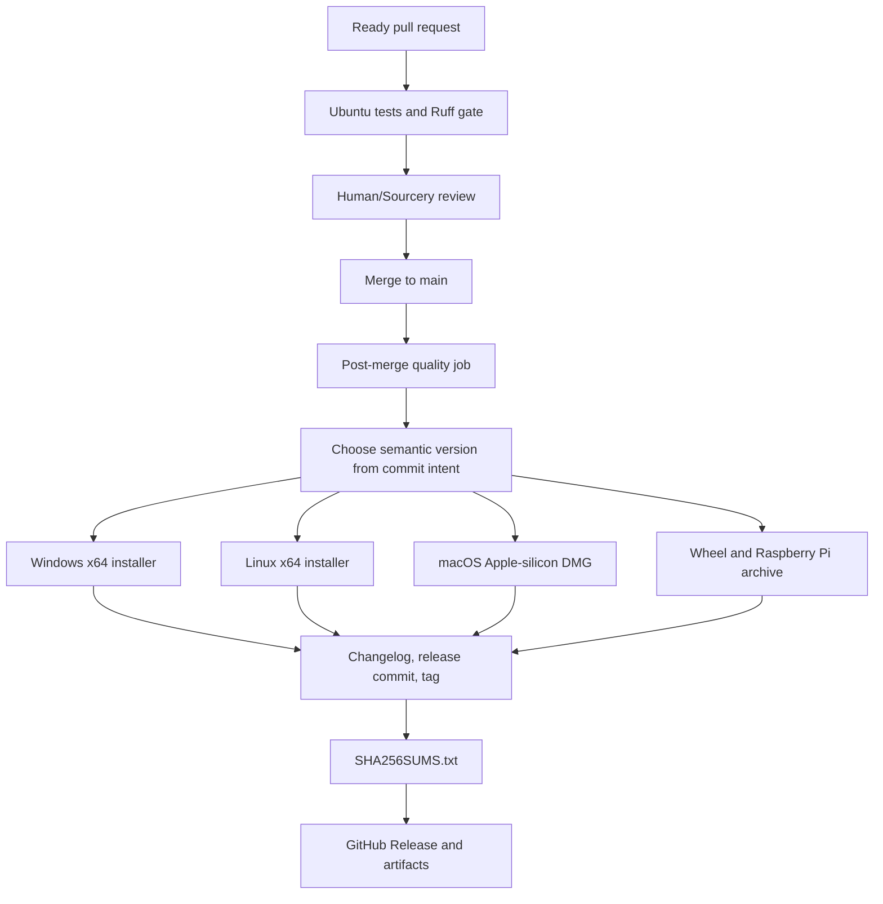

Pull requests run only the quality gate. A successful main run selects the next version,
builds all targets, promotes curated `Unreleased` changelog notes, creates a release
commit/tag, and publishes one release with checksums.
